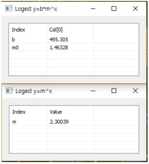

# Logest

Ensor.Logest\(Ensor\* pEnsor1, Ensor\* pEnsor2,bool const\)

#### Parameters

* Ensor\* pEnsor1

Ensor.new\(\) 함수등에 의해 만들어진 포인터를 입력합니다\(x data\).

* Ensor\* pEnsor2

Ensor.new\(\) 함수등에 의해 만들어진 포인터를 입력합니다\(y data\).

* bool const

const : true이면 상수항을 1로 고정합니다.

const : false이면 상수항을 구합니다.

#### Return Value

Ensor\* pRetEnsor : 3번째 argument에 의해 선택된 결과값를 가진 Ensor\*를 반환합니다.

#### Remarks

* bool false

y = b\*m^x로 x, y데이터을 가지고 b와m을 구한 pEnsor\*를 반환합니다.

* bool true

y = m^x로 x, y데이터을 가지고 m을 구한 pEnsor\*를 반환합니다.

#### Examples1

```lua
function MathEquation()
    local ensor_x = ensor.new("{11,12,13,14,15,16}")
      local ensor_y = ensor.new("{33100,47300,69000,102000,150000,220000}")
    local ensor_z = ensor.Logest(ensor_x,ensor_y,false)
    local ensor_z2 = ensor.Logest(ensor_x,ensor_y,true)

     ensor.Table(ensor_z)
    ensor.Table(ensor_z2)
end
```

#### Result1



