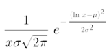
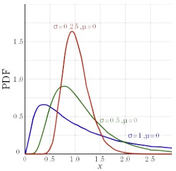
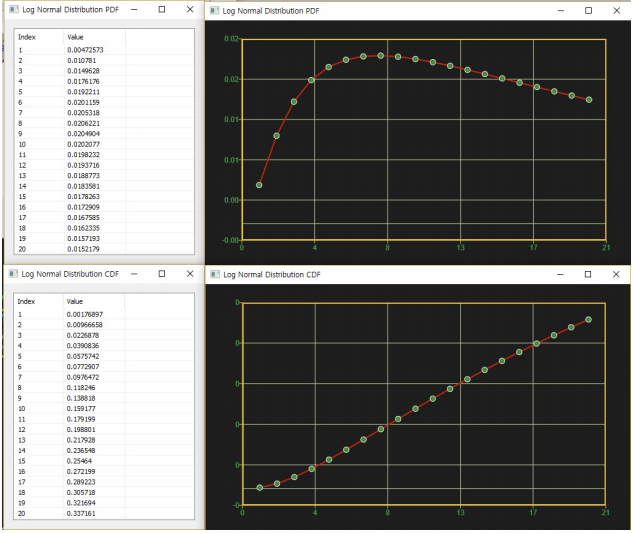

# LogNormalDist

Ensor.LogNormalDist\(Ensor\* pEnsor, double mean,double sigma,bool cumulative \)

#### Parameters

* Ensor\* pEnsor

Ensor.new\(\) 함수등에 의해 만들어진 포인터를 입력합니다\(eval value\).

* double mean

mean 값을 입력합니다\(평균\).

* double sigma

sigma 값을 입력합니다\(표준편차\).

* bool cumulative 

cumulative  : true 이면 누적분포값을 반환합니다.

cumulative  : false이면 ,확률 밀도값을 반환합니다.

#### Return Value

Ensor\* pRetEnsor : pEnsor의 엘리먼트에 맞는 갯수만큼 계산된 Ensor\*를 반환합니다.

#### Remarks

* PDF





* CDF


#### Examples1

```lua
function MathEquation()
    local ensor_x = ensor.new("{1,2,3,4,5,6,7,8,9,10,11,12,13,14,15,16,17,18,19,20}")
    local ensor_y = ensor.LogNormalDist(ensor_x,3.5,1.2,true)
    local ensor_y2 = ensor.LogNormalDist(ensor_x,3.5,1.2,false)

     ensor.Table(ensor_y)
    ensor.Plot(ensor_y)
    ensor.Table(ensor_y2)
    ensor.Plot(ensor_y2)
end
```

#### Result



