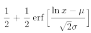
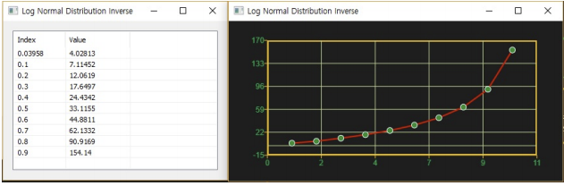

# LogNormalInv

Ensor.LogNormalInv\(Ensor\* pEnsor, double mean,double sigma,bool cumulative \)

#### Parameters

* Ensor\* pEnsor

Ensor.new\(\) 함수등에 의해 만들어진 포인터를 입력합니다\(Probability value\).

* double mean

mean 값을 입력합니다\(평균\).

* double sigma

sigma 값을 입력합니다\(표준편차\).

#### Return Value

Ensor\* pRetEnsor : pEnsor의 엘리먼트에 맞는 갯수만큼 계산된 Ensor\*를 반환합니다.

#### Remarks

* CDF




#### Examples1

```lua
function MathEquation()
	local ensor_x = ensor.new("{0.03958,0.1,0.2,0.3,0.4,0.5,0.6,0.7,0.8,0.9}")
	local ensor_y = ensor.LogNormalInv(ensor_x,3.5,1.2)

 	ensor.Table(ensor_y)
	ensor.Plot(ensor_y)
end	
```

#### Result



