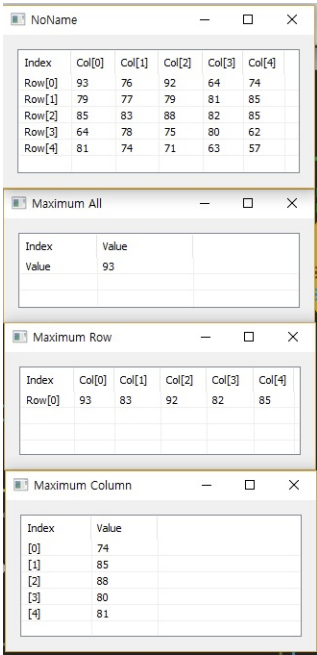

# Max

Ensor.Max\(Ensor\* pEnsor \)

Ensor.Max\(Ensor\* pEnsor,string option \)

#### Parameters

* Ensor\* pEnsor

Ensor.new\(\) 함수등에 의해 만들어진 포인터를 입력합니다\(data\).

* string option

"row" : row 방향으로 최대값을 column갯수만큼 찾습니다.

"column" : column 방향으로 최대값을 row갯수만큼 찾습니다.

#### Return Value

Ensor\* pRetEnsor : option에 따라 맞는 갯수만큼 계산된 Ensor\*를 반환합니다.

#### Remarks

* option 항목이 없으면 전체 data에서 최대값을 찾아 반환합니다.


#### Examples1

```lua
function MathEquation()
	--TODO Add your lua script code here
 	local ensor_x = ensor.new("/{/{93,76,92,64,74},{79,77,79,81,85},{85,83,88,82,85},{64,78,75,80,62},{81,74,71,63,57/}/}")
 	local ensor_y = ensor.Max(ensor_x)
	local ensor_y2 = ensor.Max(ensor_x,"row")
	local ensor_y3 = ensor.Max(ensor_x,"column")

	 ensor.Table(ensor_x)
 	ensor.Table(ensor_y)
	ensor.Table(ensor_y2)
	ensor.Table(ensor_y3)
 end
```

#### Result



