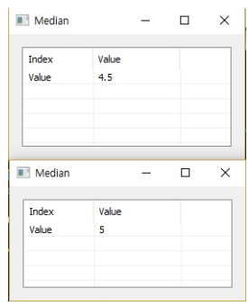

# Max

Ensor.Max\(Ensor\* pEnsor \)

#### Parameters

* Ensor\* pEnsor

Ensor.new\(\) 함수등에 의해 만들어진 포인터를 입력합니다\(data\).

#### Return Value

Ensor\* pRetEnsor : 중앙값을 가진 Ensor\*를 반환합니다.

#### Remarks

* 엘리먼트의 갯수가 짝수이면 가운데에 근접한 두 수의 평균을 반환합니다.

#### Examples1

```lua
 function MathEquation()
	local ensor_x = ensor.new("{1,2,3,4,5,6,7,8}")
	local ensor_x2 = ensor.new("{1,2,3,4,5,6,7,8,9}")
 	local ensor_y = ensor.Median(ensor_x)
	local ensor_y2 = ensor.Median(ensor_x2)

	ensor.Table(ensor_y)
	ensor.Table(ensor_y2)
 end
```

#### Result



