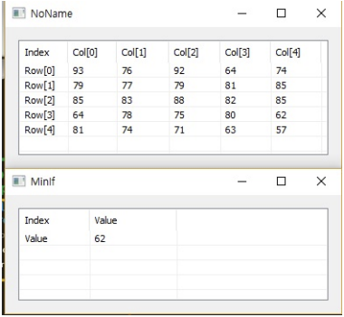

# MinIf

Ensor.MinIf\(Ensor\* pEnsor,string condition \)

#### Parameters

* Ensor\* pEnsor

Ensor.new\(\) 함수등에 의해 만들어진 포인터를 입력합니다\(data\).

* string condition

"condition" : lua script 문법으로 조건을 입력합니다.

#### Return Value

Ensor\* pRetEnsor : condition에 맞는 데이터 중에서 최소값을 찾아 그값을 가진 Ensor\*를 반환합니다.

#### Remarks

#### Examples1

```lua
function MathEquation()
	--TODO Add your lua script code here
 	local ensor_x = ensor.new("/{/{93,76,92,64,74},{79,77,79,81,85},{85,83,88,82,85},{64,78,75,80,62},{81,74,71,63,57/}/}")
 	local ensor_y = ensor.MinIf(ensor_x,"d < 90 and d>60")

	ensor.Table(ensor_x)
	ensor.Table(ensor_y)
 end
```

#### Result



