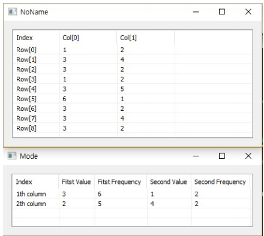

# Mode

Ensor.Mode\(Ensor\* pEnsor \)

#### Parameters

* Ensor\* pEnsor

Ensor.new\(\) 함수등에 의해 만들어진 포인터를 입력합니다\(data\).

#### Return Value

Ensor\* pRetEnsor : 각 Column에 대한 가장 많은 빈도수와 두번째 많은 빈도수에 대한 값과 빈도수를 가진 Ensor\*를 반환합니다.

#### Remarks


#### Examples1

```lua
 function MathEquation()
	local ensor_x = ensor.new("/{/{1,2},{3,4},{3,2},{1,2},{3,5},{6,1},{3,2},{3,4},{3,2/}/}")
 	local ensor_y = ensor.Mode(ensor_x)

	ensor.Table(ensor_x)
	ensor.Table(ensor_y)
 end
```

#### Result



