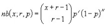
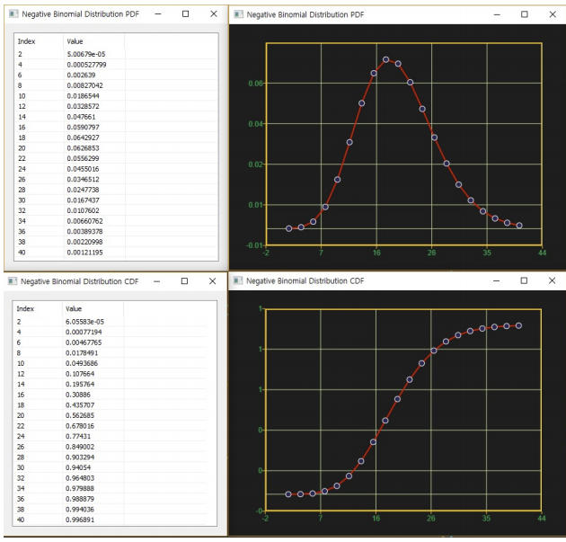
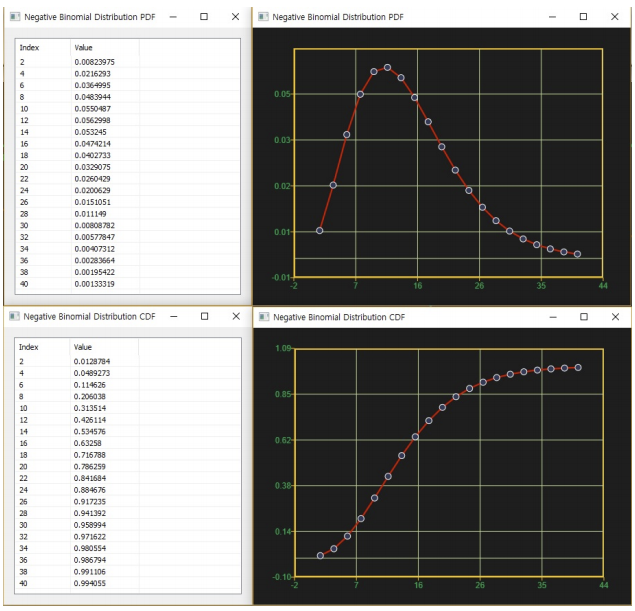

# NegBinomDist

Ensor.NegBinomDist\(Ensor\* pEnsor, int nSucces,double succesP,bool cumulative \)

#### Parameters

* Ensor\* pEnsor

Ensor.new\(\) 함수등에 의해 만들어진 포인터를 입력합니다\(실패회수\).

* int nSucces

nSucces 값을 입력합니다\(성공회수\).

* double succesP

succesP 값을 입력합니다\(성공확률\).

* bool cumulative 

cumulative  : true 이면 누적분포값을 반환합니다.

cumulative  : false이면 ,확률 밀도값을 반환합니다.

#### Return Value

Ensor\* pRetEnsor : pEnsor의 엘리먼트에 맞는 갯수만큼 계산된 Ensor\*를 반환합니다.

#### Remarks

성공확률이 succesP인 모집단에서 nSucces성공회수 이전에 pEnsor만큼 실패할 확률을 구합니다.

* **PDF**



where:

x is pEnsor\(failure number\), r is nSucces , and p is succesP.

* **CDF**

#### Examples1

```lua
 function MathEquation()
 	local ensor_x = ensor.new("{2,4,6,8,10,12,14,16,18,20,22,24,26,28,30,32,34,36,38,40}")
 	local ensor_y = ensor.NegBinomDist(ensor_x,20,0.5,false)
 	local ensor_y2 = ensor.NegBinomDist(ensor_x,20,0.5,true)

 	ensor.Plot(ensor_x, ensor_y)
	ensor.Plot(ensor_x, ensor_y2)
 	ensor.Table(ensor_y)
	ensor.Table(ensor_y2)
 end
```

#### Result1



**Examples2**

```lua
function MathEquation()
 	local ensor_x = ensor.new("{2,4,6,8,10,12,14,16,18,20,22,24,26,28,30,32,34,36,38,40}")
 	local ensor_y = ensor.NegBinomDist(ensor_x,5,0.25,false)
 	local ensor_y2 = ensor.NegBinomDist(ensor_x,5,0.25,true)

 	ensor.Plot(ensor_x, ensor_y)
	ensor.Plot(ensor_x, ensor_y2)
 	ensor.Table(ensor_y)
	ensor.Table(ensor_y2)
 end
```

#### Result2



