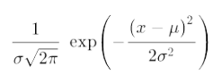
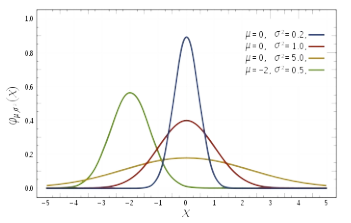
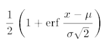
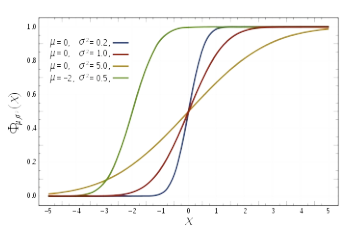
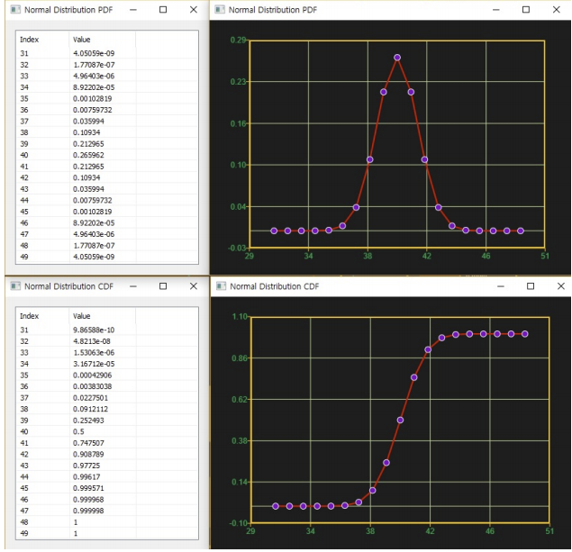

# NormalDist

Ensor.NormalDist\(Ensor\* pEnsor, double mean,double sigma,bool cumulative \)

#### Parameters

* Ensor\* pEnsor

Ensor.new\(\) 함수등에 의해 만들어진 포인터를 입력합니다\(eval data\).

* double mean

mean 값을 입력합니다\(평균\).

* double sigma

sigma값을 입력합니다\(표준편차\).

* bool cumulative 

cumulative  : true 이면 누적분포값을 반환합니다.

cumulative  : false이면 ,확률 밀도값을 반환합니다.

#### Return Value

Ensor\* pRetEnsor : pEnsor의 엘리먼트에 맞는 갯수만큼 계산된 Ensor\*를 반환합니다.

#### Remarks

* **PDF**





* **CDF**





#### Examples1

```lua
function MathEquation()
    --TODO Add your lua script code here
     local ensor_x = ensor.new("{31,32,33,34,35,36,37,38,39,40,41,42,43,44,45,46,47,48,49}")
     local ensor_y = ensor.NormalDist(ensor_x,40,1.5,false)
     local ensor_y2 = ensor.NormalDist(ensor_x,40,1.5,true)

     ensor.Plot(ensor_x, ensor_y)
    ensor.Plot(ensor_x, ensor_y2)
     ensor.Table(ensor_y)
    ensor.Table(ensor_y2)
end
```

#### Result1



