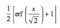
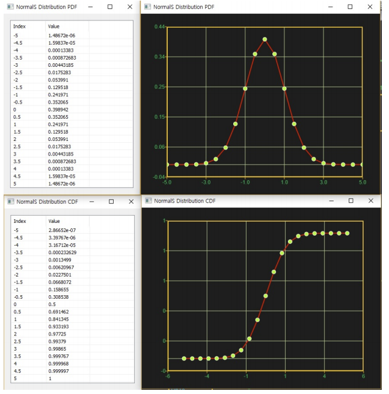

# NormalSDist

Ensor.NormalSDist\(Ensor\* pEnsor, bool cumulative \)

#### Parameters

* Ensor\* pEnsor

Ensor.new\(\) 함수등에 의해 만들어진 포인터를 입력합니다\(eval data\).

* bool cumulative 

cumulative  : true 이면 누적분포값을 반환합니다.

cumulative  : false이면 ,확률 밀도값을 반환합니다.

#### Return Value

Ensor\* pRetEnsor : pEnsor의 엘리먼트에 맞는 갯수만큼 계산된 Ensor\*를 반환합니다.

#### Remarks

* NormalDist 분포의 mean = 0, sigma = 1 인 분포이다.
* **PDF**


* **CDF**



#### Examples1

```lua
function MathEquation()
     local ensor_x = ensor.new("{-5,-4.5,-4,-3.5,-3,-2.5,-2,-1.5,-1,-0.5,0,0.5,1,1.5,2,2.5,3,3.5,4,4.5,5}")
     local ensor_y = ensor.NormalSDist(ensor_x,false)
     local ensor_y2 = ensor.NormalSDist(ensor_x,true)

     ensor.Plot(ensor_x, ensor_y)
     ensor.Plot(ensor_x, ensor_y2)
     ensor.Table(ensor_y)
     ensor.Table(ensor_y2)
end
```

#### Result1



