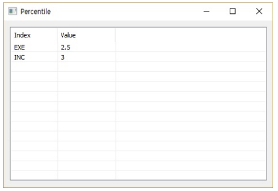
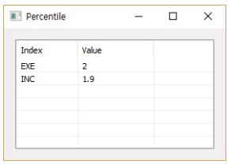

# Percentile

Ensor.Percentile\(Ensor\* pEnsor, double k \)

#### Parameters

* Ensor\* pEnsor

Ensor.new\(\) 함수등에 의해 만들어진 포인터를 입력합니다\(data set\).

* double k

k 값을 입력합니다\(0 &lt; percentile value &lt; 1\).

#### Return Value

Ensor\* pRetEnsor : 계산된 Percentile을 가진  Ensor\*를 반환합니다.

#### Remarks

Returns the k-th percentile of values in a range, where k is in the range 0..1, exclusive

If k is not a multiple of 1/\(n - 1\), Percentile interpolates to determine the value at the k-th percentile.

#### Examples1

```lua
function MathEquation()
    local ensor_x = ensor.new("{1,2,3,6,6,6,7,8,9}")
    local ensor_y = ensor.Percentile(ensor_x,0.25)

     ensor.Table(ensor_y)

end
```

#### Result1



#### Examples2

```lua
function MathEquation()
    local ensor_x = ensor.new("{1,3,2,4}")
    local ensor_y = ensor.Percentile(ensor_x,0.3)

     ensor.Table(ensor_y)
end
```

#### Result2



