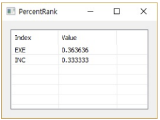
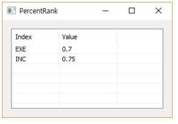

# PercenRank

Ensor.PercenRank\(Ensor\* pEnsor, double k \)

#### Parameters

* Ensor\* pEnsor

Ensor.new\(\) 함수등에 의해 만들어진 포인터를 입력합니다\(data set\).

* double k

k 값을 입력합니다\(value\).

#### Return Value

Ensor\* pRetEnsor : 계산된 PercenRank를 가진  Ensor\*를 반환합니다.

#### Remarks

Returns the rank of a value in a data set as a percentage \(0..1, exclusive\) of the data set.

#### Examples1

```lua
function MathEquation()
    local ensor_x = ensor.new("{13,12,11,8,4,3,2,1,1,1}")
    local ensor_y = ensor.PercentRank(ensor_x,2)

     ensor.Table(ensor_y)
end
```

#### Result1



#### Examples2

```lua
function MathEquation()
    local ensor_x = ensor.new("{1,2,3,6,6,6,7,8,9}")
    local ensor_y = ensor.PercentRank(ensor_x,7)

     ensor.Table(ensor_y)
end
```

#### Result2



