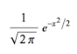
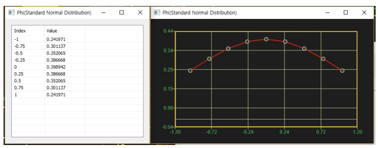

# Phi

Ensor.Phi\(Ensor\* pEnsor \)

#### Parameters

* Ensor\* pEnsor

Ensor.new\(\) 함수등에 의해 만들어진 포인터를 입력합니다\(eval data\).

* bool cumulative 

cumulative  : true 이면 누적분포값을 반환합니다.

cumulative  : false이면 ,확률 밀도값을 반환합니다.

#### Return Value

Ensor\* pRetEnsor : pEnsor의 엘리먼트에 맞는 갯수만큼 계산된 Ensor\*를 반환합니다.

#### Remarks

* Returns Standard Normal Distribution density.



#### Examples1

```lua
function MathEquation()
 	local ensor_x = ensor.new("{-1,-0.75,-0.5,-0.25,0,0.25,0.5,0.75,1}")
 	local ensor_y = ensor.Phi(ensor_x)

	ensor.Plot(ensor_x,ensor_y)
 	ensor.Table(ensor_y)
 end
```

#### Result1



