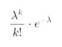
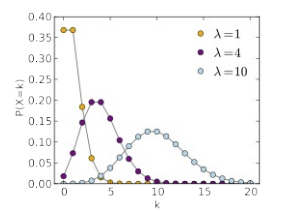
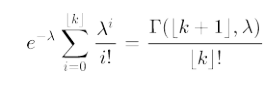
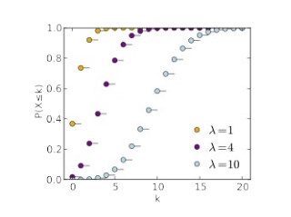
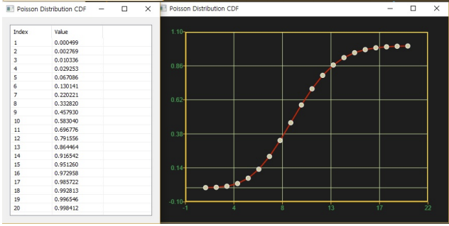

# PoissonDist

Ensor.PoissonDist\(Ensor\* pEnsor, double mean,bool cumulative \)

#### Parameters

* Ensor\* pEnsor

Ensor.new\(\) 함수등에 의해 만들어진 포인터를 입력합니다.

* double mean

평균\(mean\)값을 입력합니다.

* bool cumulative 

cumulative  : true 이면 누적분포값을 반환합니다.

cumulative  : false이면 ,확률 밀도값을 반환합니다.

#### Return Value

Ensor\* pRetEnsor : pEnsor의 엘리먼트에 맞는 갯수만큼 계산된 Ensor\*를 반환합니다.

#### Remarks

* **PDF**





* **CDF**





#### Examples1

```lua
function MathEquation()
     local ensor_x = ensor.new("{1,2,3,4,5,6,7,8,9,10,11,12,13,14,15,16,17,18,19,20}")
    local ensor_y = ensor.PoissonDist(ensor_x,10,false)
    local ensor_y2 = ensor.PoissonDist(ensor_x,10,true)

    ensor.Plot(ensor_x, ensor_y)
    ensor.Plot(ensor_x, ensor_y2)
     ensor.Table(ensor_y)
    ensor.Table(ensor_y2)
end
```

#### Result




