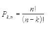
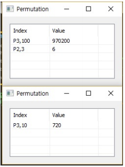

# Permut

Ensor.Permut\(Ensor\* pEnsor, Ensor\* pEnsor2\)

Ensor.Permut\(int n, int k\)

#### Parameters

* Ensor\* pEnsor

Ensor.new\(\) 함수등에 의해 만들어진 포인터를 입력합니다\(n set\).

* Ensor\* pEnsor2

Ensor.new\(\) 함수등에 의해 만들어진 포인터를 입력합니다\(k set\).

* int n

n 값을 입력합니다\(value\).

* int k

k 값을 입력합니다\(value\).

#### Return Value

Ensor\* pRetEnsor : pEnsor의 엘리먼트에 맞는 갯수만큼 계산된 Ensor\*를 반환합니다.

#### Remarks

* The equation for the number of permutations is:



#### Examples1

```lua
function MathEquation()
 	local ensor_x = ensor.new("{100,3}")
	local ensor_x2 = ensor.new("{3,2}")
 	local ensor_y = ensor.Permut(ensor_x,ensor_x2)
	local ensor_y2 = ensor.Permut(10,3)

 	ensor.Table(ensor_y)
	ensor.Table(ensor_y2)
 end
```

#### Result1



