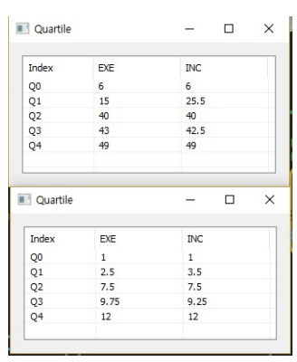

# Quartile

Ensor.Quartile\(Ensor\* pEnsor \)

#### Parameters

* Ensor\* pEnsor

Ensor.new\(\) 함수등에 의해 만들어진 포인터를 입력합니다\(data set\).

#### Return Value

Ensor\* pRetEnsor : 계산된 quartile Ensor\*를 반환합니다.

#### Remarks

Returns the quartile of the data set, based on percentile values from 0..1, exclusive.

#### Examples1

```lua
function MathEquation()
	local ensor_x = ensor.new("{6,7,15,36,39,40,41,42,43,47,49}")
  	local ensor_x2 = ensor.new("{1,2,4,7,8,9,10,12}")
	local ensor_y = ensor.Quartile(ensor_x)
	local ensor_y2 = ensor.Quartile(ensor_x2)

 	ensor.Table(ensor_y)
	ensor.Table(ensor_y2)
 end
```

#### Result1




