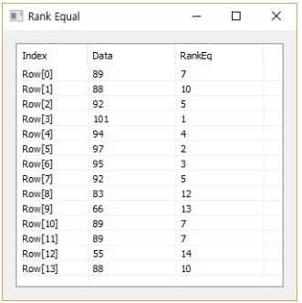
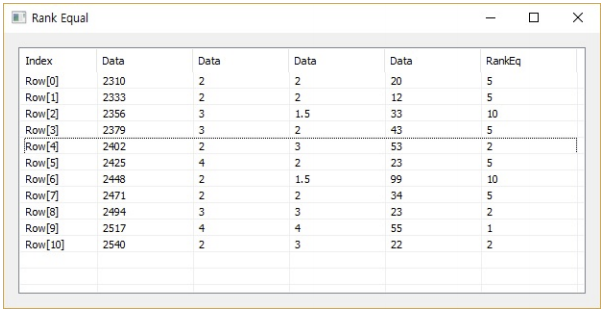

# RankEq

Ensor.RankEq\(Ensor\* pEnsor \)

Ensor.RankEq\(Ensor\* pEnsor, int col \)

#### Parameters

* Ensor\* pEnsor

Ensor.new\(\) 함수등에 의해 만들어진 포인터를 입력합니다\(data set\).

* int col

Rank를 결정할 column 번호를 입력합니다.

#### Return Value

Ensor\* pRetEnsor : 계산된 RankEq Ensor\*를 반환합니다.

#### Remarks

if more than one value has the same rank, the average rank is returned.

#### Examples1

```lua
function MathEquation()
    local ensor_x = ensor.new("{89,88,92,101,94,97,95,92,83,66,89,89,55,88}")
    local ensor_y = ensor.RankEq(ensor_x)

     ensor.Table(ensor_y)
 end
```

#### Result1

Argument 2가 없으면 마지막 칼럼을 기준으로 Rank를 정함.



#### Examples2

```lua
function MathEquation()
    local ensor_x = ensor.new("/{/{2310,2,2,20},{2333,2,2,12},{2356,3,1.5,33},{2379,3,2,43},{2402,2,3,53},{2425,4,2,23},{2448,2,1.5,99},{2471,2,2,34},{2494,3,3,23},{2517,4,4,55},{2540,2,3,22/}/}")
     local ensor_y = ensor.RankEq(ensor_x,3)

     ensor.Table(ensor_y)
 end
```

#### Result2

Argument 2가 있으면 Argument 2 칼럼을 기준으로 Rank를 정함.



