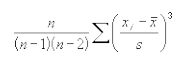
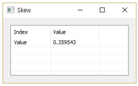

# Skew

Ensor.Skew\(Ensor\* pEnsor1\)

#### Parameters

* Ensor\* pEnsor1

Ensor.new\(\) 함수등에 의해 만들어진 포인터를 입력합니다\(data1\).

#### Return Value

Ensor\* pRetEnsor : skewness 를 가진 Ensor\*를 반환합니다.

#### Remarks

* The equation for the Skew  is:

  

* Returns the skewness of a distribution. Skewness characterizes the degree of asymmetry of a distribution around its mean. Positive skewness indicates a distribution with an asymmetric tail extending toward more positive values. Negative skewness indicates a distribution with an asymmetric tail extending toward more negative values.

#### Examples1

```lua
function MathEquation()
    local ensor_x = ensor.new("{3,4,5,2,3,4,5,6,4,7}")
    local ensor_y = ensor.Skew(ensor_x)

     ensor.Table(ensor_y)
end
```

#### Result



