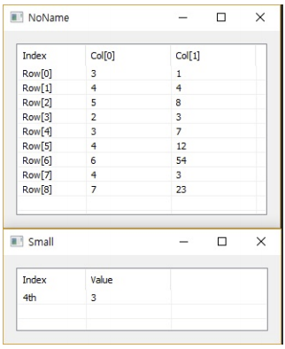

# Small

Ensor.Small\(Ensor\* pEnsor, int value \)

#### Parameters

* Ensor\* pEnsor

Ensor.new\(\) 함수등에 의해 만들어진 포인터를 입력합니다\(data\).

* int value

value를 입력합니다.

#### Return Value

Ensor\* pRetEnsor : 가장 작은수로부터의 value번째의 값을 가진 Ensor\*를 반환합니다.

#### Remarks

#### Examples

```lua
function MathEquation()
	local ensor_x = ensor.new("/{/{3,1},{4,4},{5,8},{2,3},{3,7},{4,12},{6,54},{4,3},{7,23/}/}")
	local ensor_y = ensor.Small(ensor_x,4)

	ensor.Table(ensor_x)
 	ensor.Table(ensor_y)
end
```

#### Result



