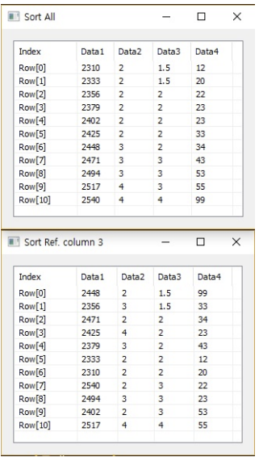

# Sort

Ensor.Sort\(Ensor\* pEnsor \)

Ensor.Sort\(Ensor\* pEnsor, int col \)

#### Parameters

* Ensor\* pEnsor

Ensor.new\(\) 함수등에 의해 만들어진 포인터를 입력합니다\(data set\).

* int col

오름차순으로 정렬할 기준 column 번호를 입력합니다.

#### Return Value

Ensor\* pRetEnsor : 정렬된 Ensor\*를 반환합니다.

#### Remarks

#### Examples1

```lua
function MathEquation()
	local ensor_x = ensor.new("/{/{2310,2,2,20},{2333,2,2,12},{2356,3,1.5,33},{2379,3,2,43},{2402,2,3,53},{2425,4,2,23},{2448,2,1.5,99},{2471,2,2,34},{2494,3,3,23},{2517,4,4,55},{2540,2,3,22/}/}")
	local ensor_y = ensor.Sort(ensor_x)
	local ensor_y2 = ensor.Sort(ensor_x,3)

	ensor.Table(ensor_y)
	ensor.Table(ensor_y2)
 end
```

#### Result1

Argument 2가 없으면 모든 칼럼을 오름차순 정렬하고 Argument 2가 있으면 Argument 2의 칼럼을 기준으로 오름차순 정렬함.




