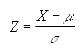

# Standardize

Ensor.Standardize\(Ensor\* pEnsor, double mean,double sigma \)

#### Parameters

* Ensor\* pEnsor

Ensor.new() 함수등에 의해 만들어진 포인터를 입력합니다(eval data).

* double mean

평균\(mean\)값을 입력합니다.

* double sigma 

sigma값을 입력합니다(표준편차).

#### Return Value

Ensor\* pRetEnsor : pEnsor의 엘리먼트에 맞는 갯수만큼 계산된 Ensor\*를 반환합니다.

#### Remarks

The equation for the normalized value is:




#### Examples1

```lua
function MathEquation()
	local ensor_x = ensor.new("{35,36,37,38,39,40,41,42,43,44,45}")
	local ensor_y = ensor.Standardize(ensor_x,40,1.5)
	ensor.Table(ensor_y)

end
```

#### Result


