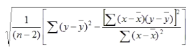
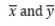

# Steyx

Ensor.Steyx\(Ensor\* pEnsor, Ensor pEnsor2 \)

#### Parameters

* Ensor\* pEnsor1

Ensor.new() 함수등에 의해 만들어진 포인터를 입력합니다(data x).


* Ensor\* pEnsor2

Ensor.new() 함수등에 의해 만들어진 포인터를 입력합니다(data y).

#### Return Value

Ensor\* pRetEnsor : correlation coefficient를 가진 Ensor\*를 반환합니다.

#### Remarks

The equation for the standard error of the predicted y is:



where
are the sample means Average(data1) and Average(data2), and n is the sample size.

#### Examples1

```lua
function MathEquation()
	local ensor_x = ensor.new("{6,5,11,7,5,4,4}")
		local ensor_y = ensor.new("{2,3,9,1,8,7,5}")
	local ensor_ans = ensor.Steyx(ensor_x,ensor_y)
		ensor.Table(ensor_ans)


end
```

#### Result


