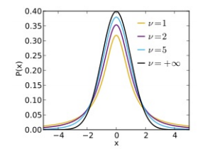
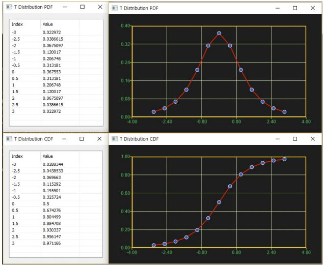

# TDist

Ensor.TDist\(Ensor\* pEnsor, int df, bool cumulative\)

#### Parameters

* Ensor\* pEnsor

Ensor.new\(\) 함수등에 의해 만들어진 포인터를 입력합니다\(eval data\).

* bool cumulative 

cumulative  : true 이면 누적분포값을 반환합니다.

cumulative  : false이면 ,확률 밀도값을 반환합니다.

#### Return Value

Ensor\* pRetEnsor : pEnsor의 엘리먼트에 맞는 갯수만큼 계산된 Ensor\*를 반환합니다.


#### Remarks

* **PDF**




* **CDF**


where 2F1 is the hypergeometric function.


#### Examples1

```lua
function MathEquation()
	local ensor_x = ensor.new("{-3,-2.5,-2,-1.5,-1,-0.5,0,0.5,1,1.5,2,2.5,3}")
	local ensor_ans = ensor.TDist(ensor_x,3,false)
	local ensor_ans2 = ensor.TDist(ensor_x,3,true)
	ensor.Table(ensor_ans)
	ensor.Plot(ensor_x,ensor_ans)
	ensor.Table(ensor_ans2)
	ensor.Plot(ensor_x,ensor_ans2)
end
```

#### Result1



