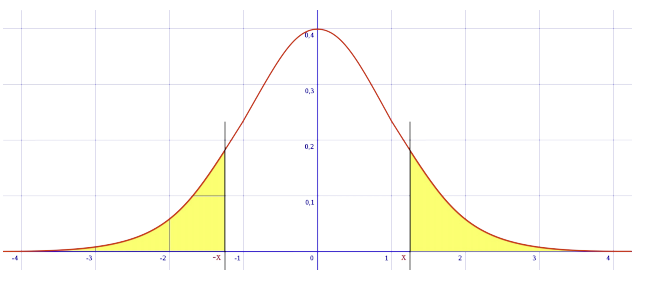
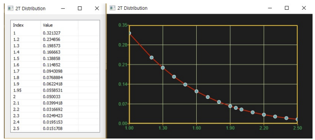

# TDist2T

Ensor.TDist2T\(Ensor\* pEnsor, int df\)

#### Parameters

* Ensor\* pEnsor

Ensor.new\(\) 함수등에 의해 만들어진 포인터를 입력합니다.

* int df 

자유도(Degrees of Freedom )값을 입력합니다

#### Return Value

Ensor\* pRetEnsor : pEnsor의 엘리먼트에 맞는 갯수만큼 계산된 Ensor\*를 반환합니다


#### Remarks

Returns the two-tailed Student's t-distribution.




#### Examples1

```lua
function MathEquation()
	local ensor_x = ensor.new("{1,1.2,1.3,1.4,1.5,1.6,1.7,1.8,1.9,1.95,2.0,2.1,2.2,2.3,
								2.4,2.5}")
	local ensor_ans = ensor.TDist2T(ensor_x,60)
	ensor.Table(ensor_ans)
	ensor.Plot(ensor_x,ensor_ans)

end
```

#### Result1



