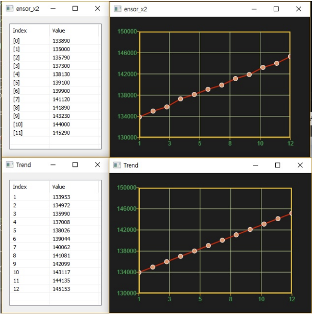

# Trend

Ensor.Trend\(Ensor\* pEnsor2, Ensor\* pEnsor2, Ensor\* pEnsor3\)

#### Parameters

* Ensor\* pEnsor1

Ensor.new() 함수등에 의해 만들어진 포인터를 입력합니다(x data).

* Ensor\* pEnsor2

Ensor.new() 함수등에 의해 만들어진 포인터를 입력합니다(y data).

* Ensor\* pEnsor3

예측할 x 데이터를 Ensor\*로 입력합니다.

#### Return Value

Ensor\* pRetEnsor : 3번째 argument에 의해 구해진 결과값를 가진 Ensor\*를 반환합니다.


#### Remarks

Ensor\* pEnsor3
y = a\*x +b 로 x, y데이터을 가지고 b와a 구해서 pEnsor3의 값에 해당하는 y값을 예측하여 pEnsor3의 element
갯수 만큼의 값을 가진 pEnsor\*를 반환합니다.

#### Examples1

```lua
function MathEquation()
	local ensor_x = ensor.new("{1,2,3,4,5,6,7,8,9,10,11,12}")
		local ensor_x2 = ensor.new("{133890,135000,135790,137300,138130,139100,139900,141
									120,141890,143230,144000,145290}")
	local ensor_y = ensor.Trend(ensor_x,ensor_x2,ensor_x)
	ensor.Name(ensor_x2,"ensor_x2")
	ensor.Plot(ensor_x,ensor_x2)
	ensor.Plot(ensor_x,ensor_y)
	ensor.Table(ensor_x2)
	ensor.Table(ensor_y)
end
```

#### Result1



