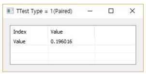
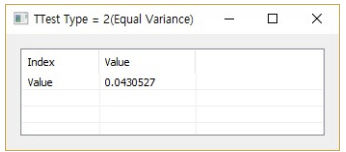
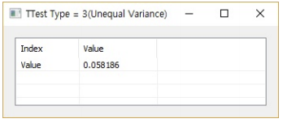

# TTest

Ensor.TTest\(Ensor\* pEnsor, Ensor\* pEnsor2, int tail, int type\)

#### Parameters

* Ensor\* pEnsor1
	Ensor.new() 함수등에 의해 만들어진 포인터를 입력합니다(first data).
*Ensor\* pEnsor2
	Ensor.new() 함수등에 의해 만들어진 포인터를 입력합니다(second data).
*int tail
	tail = 1 : one tailed
	tail = 2 : two tailed
*int type
	type = 1 : Paired
	type = 2 : Two-sample equal variance (homoscedastic).
	type = 3 : Two-sample unequal variance (heteroscedastic)

#### Return Value

Ensor\* pRetEnsor : TTest 결과를 가진 Ensor\*를 반환합니다.


#### Remarks

Returns the two-tailed Student's t-distribution.


#### Examples1

```lua
function MathEquation()
	local ensor_x = ensor.new("{3,4,5,8,9,1,2,4,5}")
		local ensor_x2 = ensor.new("{6,19,3,2,14,4,5,17,1}")
	local ensor_y = ensor.TTest(ensor_x,ensor_x2,2,1)
	ensor.Table(ensor_y)

end
```

#### Result1



#### Examples2

```lua
function MathEquation()
	local ensor_x = ensor.new("{13,17,19,11,20,15,18,9,12,16}")
		local ensor_x2 = ensor.new("{12,8,6,16,12,14,10,18,4,11}")
	local ensor_y = ensor.TTest(ensor_x,ensor_x2,2,2)
	ensor.Table(ensor_y)
end
```

#### Result2



#### Examples3

```lua
function MathEquation()
	local ensor_x = ensor.new("{20,32,2,25,5,18,21,7,28,40}")
		local ensor_x2 = ensor.new("{12,8,6,16,12,14,10,18,4,11}")
	local ensor_y = ensor.TTest(ensor_x,ensor_x2,2,3)
	ensor.Table(ensor_y)

end
```

#### Result3


