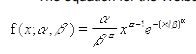
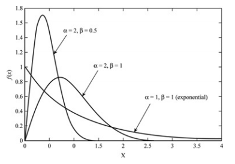
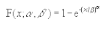
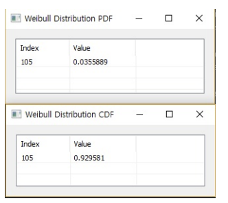

# WeibullDist

Ensor.WeibullDist\(Ensor\* pEnsor, double alpha,double beta,bool cumulative\ )

#### Parameters

 * Ensor\* pEnsor
	Ensor.new() 함수등에 의해 만들어진 포인터를 입력합니다.
 * double alpha
	Weibull 분포의 alpha 값을 입력합니다.
 * double beta
	Weibull 분포의 beta 값을 입력합니다.
 * bool cumulative
	cumulative : true 이면 누적분포값을 반환합니다.
	cumulative : false이면 ,확률 밀도값을 반환합니다.


#### Return Value

Ensor\* pRetEnsor : pEnsor의 엘리먼트에 맞는 갯수만큼 계산된 Ensor\*를 반환합니다.


#### Remarks

The equation for the Weibull probability density function is:



The equation for the Weibull cumulative distribution function is:


#### Examples1

```lua
function MathEquation()
	local ensor_x = ensor.new("{105}")
	local ensor_y = ensor.WeibullDist(ensor_x,20,100,true)
	local ensor_y2 = ensor.WeibullDist(ensor_x,20,100,false)
	ensor.Table(ensor_y)
	ensor.Table(ensor_y2)
end
```

#### Result1

