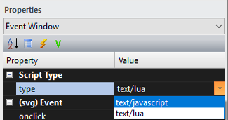
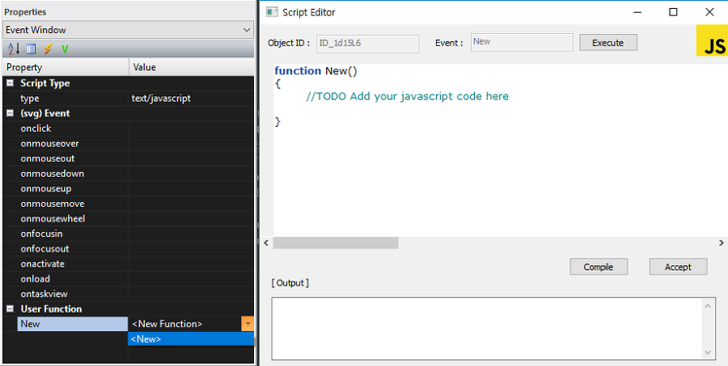
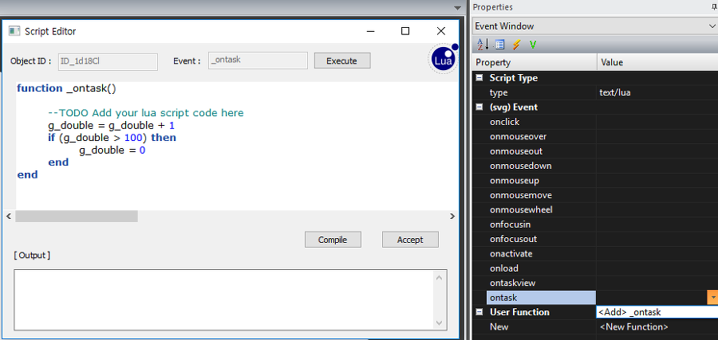
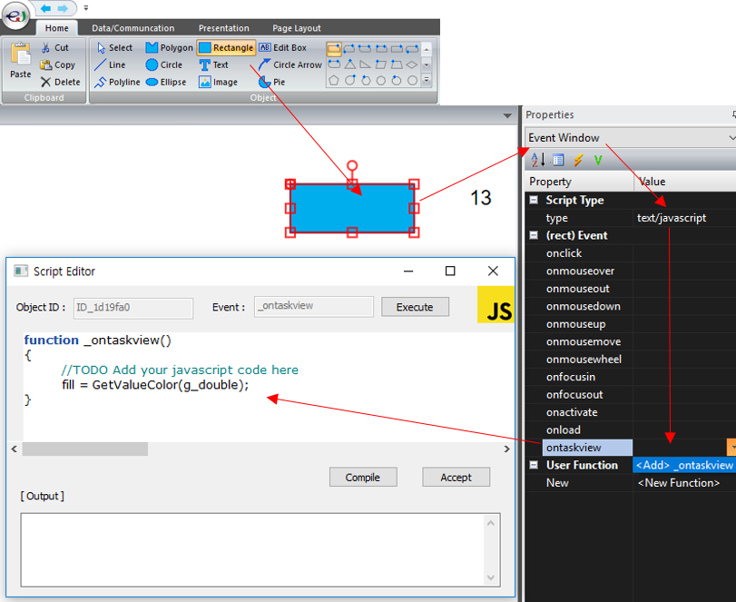

Revision 2019.02.21 - enuSpace for saturn \(v4.0\)

# **enuSpace - 첫 프로젝트 만들기**

---

동영상으로 미리보기

[lesson1.zip](http://enuspace.tistory.com/attachment/cfile6.uf@2437B74D58F9623C14493A.zip)

## **New Project**

---

새로운 프로젝트를 생성하기 위해서 Home-&gt;New-&gt;New Project 선택를 선택합니다.

New Project \(Popup Window\) 윈도우가 나타납니다. 솔루션 이름과 솔루션을 저장할 디렉토리를 설정후 OK 버튼을 클릭합니다.


Project Explorer창에 Task 하위 logic\_svg와 Global 하위 global.svg가 기본으로 생성되어 나타납니다.

Project Explorer창에서 Task 하위 logic\_svg선택하면 Script Operation-&gt;RUN 수행시 1초에 수행되는 타이머 횟수 입니다. 기본 24 Cycle로 설정됩니다. Task에 외부 모듈을 추가할 수 있는 습니다. 각 Task의 In, Out에 대한 설정을 수행하여 TASK를 제어할 수 있습니다.


Project Explorer창에서 Global 하위 global.svg는 전연변수 추가 및 전역함수를 추가하여 모든 픽쳐에서 공용으로 호출하여 활용할 수 있습니다.

global.svg의 Event Window에서 Script Type을 text/javascript를 선택합니다.



## **New Function**

---

User Function의 &lt;New&gt;를 선택하여 Javascript Editor를 창을 엽니다.

간단하게 숫자형 입력값을 주면, 색상값을 반환하는 함수 GetValueColor를 추가합니다.

```lua
function GetValueColor(fValue)
{
 var color;
 if (fValue<0)
 color = "rgb(0,0,0)";
 else if (fValue>0 && fValue <=5)
 color = "rgb(15,75,165)";
 else if (fValue>5 && fValue <=10)
 color = "rgb(30,110,200)";
 else if (fValue>10 && fValue <=15)
 color = "rgb(60,160,240)";
 else if (fValue>15 && fValue <=20)
 color = "rgb(80,180,250)";
 else if (fValue>20 && fValue <=25)
 color = "rgb(130,210,255)";
 else if (fValue>25 && fValue <=30)
 color = "rgb(160,240,255)";
 else if (fValue>30 && fValue <=35)
 color = "rgb(200,250,255)";
 else if (fValue>35 && fValue <=40)
 color = "rgb(230,255,255)";
 else if (fValue>40 && fValue <=45)
 color = "rgb(255,250,220)";
 else if (fValue>45 && fValue <=50)
 color ="rgb(255,232,120)";
 else if (fValue>50 && fValue <=55)
 color = "rgb(255,192,60)";
 else if (fValue>55 && fValue <=60)
 color = "rgb(255,160,0)";
 else if (fValue>60 && fValue <=65)
 color = "rgb(255,96,0)";
 else if (fValue>65 && fValue <=70)
 color = "rgb(255,50,0)";
 else if (fValue>70 && fValue <=75)
 color = "rgb(225,20,0)";
 else if (fValue>75 && fValue <=80)
 color = "rgb(192,0,0)";
 else 
 color = "rgb(0,0,0)";


 return color;
}
```

## **New Variable**

---

global.svg에 전역변수 하나를 추가합니다. type은 double형으로 변수명은 g\_double로 설정합니다.

## **New Picture**

---

Project Explorer의 Picture를 선택후 오른쪽 버튼을 클릭하여 팝업메뉴를 호출합니다. sample로 입력후 Create 버튼을 클릭하여 새로운 픽쳐 페이지를 생성합니다.

새로운 픽쳐가 생성된후, Project Explorer 윈도우에서 Picture하위 sample.svg를 선택한다. Properties 윈도우창에서 Event Window 선택후 ontask를 선택하여 Script Editor에 다음과 같이 코드를 작성하고 Compile 버튼 클릭후 Accept 버튼을 클릭하여 스크립트를 추가한다.

```lua
function _ontask()

    --TODO Add your lua script code here
    g_double = g_double + 1
    if (g_double > 100) then
        g_double = 0
    end

end
```

위 코드는 루아 스크립트로 작성된 코드이며, 앞에서 추가한 전역 변수에 0 ~ 100사이의 값으로 업데이트를 수행하는 코드입니다.

\* ontask 함수는 루아 스크립트의 경우에만 등록할 수 있다. ontask함수는 프로젝트 로딩시 스케쥴러의 요청에 따라 주기적으로 \(초기값 1초에 24번\) 호출되는 함수이다.

위 코드를 작성후 값을 확인할 수 있도록 Graphic Window에 Text 객체를 추가하여 보자. 추가된 Text 객체에 Javascript를 추가한다. 화면이 로딩되어 동작을 수행하는  동안 주기적으로 호출되는 함수인 ontaskview\(\)함수를 아래 코드와 같이 추가하여 본다.


```lua
function _ontaskview()
{    
    //TODO Add your javascript code here
    textContent = g_double.toString();
}
```


사각형 객체를 추가하여 색상값 변경 코드를 추가한다.



```lua
function _ontaskview()
{    
    //TODO Add your javascript code here
    fill = GetValueColor(g_double);
}
```


Home-&gt;Runtime 버튼을 클릭하여, 실제 동작화면을 통하여 변수값 변경 및 색상값 변경에 대한 결과를 확인할 수 있습니다.

