# **enuSpace를 이용한 HMI 라이브러리 생성 및 적용 방법 \(1/2\)**

---

본 절에서는 다이나믹 데이터 디스플레이를 HMI Panel 라이브러리 제작하는 과정을 포함하고 있습니다.

동영상 미리보기 [https://youtu.be/4KQ0e9EKWrY](https://youtu.be/4KQ0e9EKWrY)

# **New Project**

---

새로운 프로젝트를 생성하기 위해서 Home-&gt;New-&gt;New Project 선택를 선택합니다.

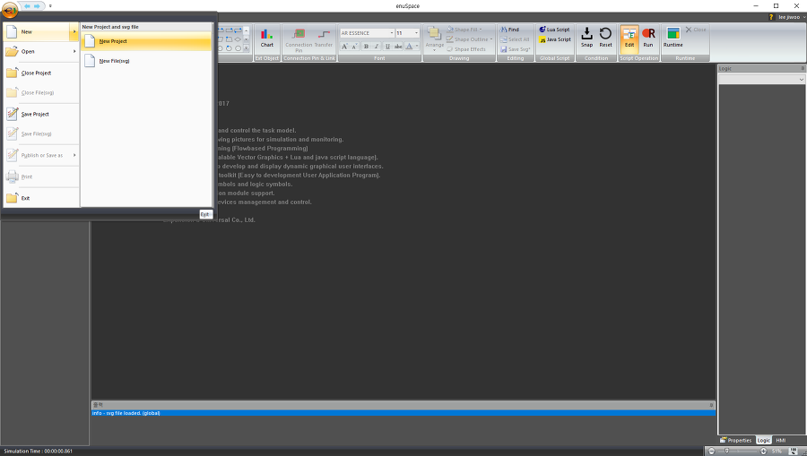

New Project \(Popup Window\) 윈도우가 나타납니다. 솔루션 이름과 솔루션을 저장할 디렉토리를 설정후 OK 버튼을 클릭합니다.


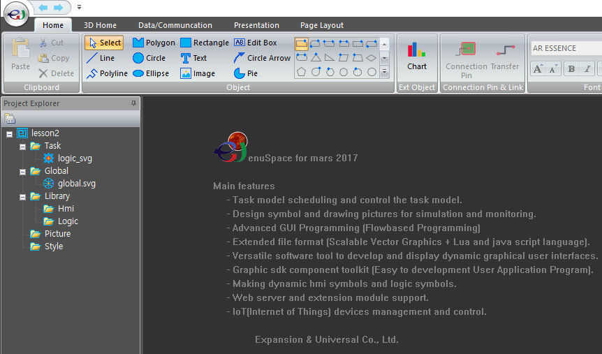

## **New Hmi library**

---

Project Explorer-&gt;Library-&gt;Hmi 아이템을 선택후 마우스 오른쪽 버튼을 클릭하여 팝업메뉴를 호출한다. 팝업메뉴 Add New Hmi Library를 선택하여 라이브러리의 이름을 입력합니다.


Project Explorer에 추가된 hmi\_library.svg 파일을 선택후 마우스 오른쪽 버튼을 클릭하여 팝업메뉴를 호출한다. 팝업메뉴 Add Symbol을 선택하여 심볼의 이름을 LABEL\_VALUE입력하고 New 버튼을 클릭합니다.

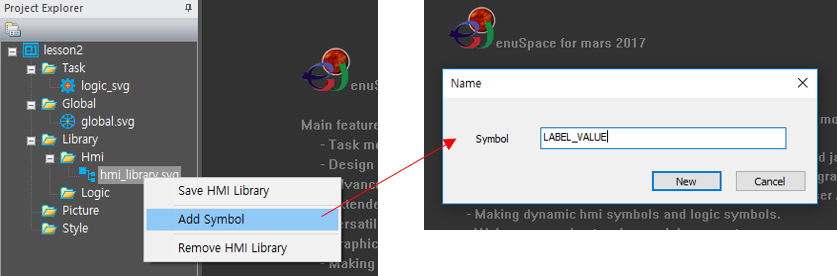

Project Explorer에서 앞에서 추가한 라이브러리를 선택하면 라이브러리 편집 Picture Window가 나타납니다.


다이나믹 디스플레이를 위한 패널 제작을 위하여 그래픽 편집도구를 이용하여 다음과 같이 구성합니다. 사각형 객체와 문자객체를 추가합니다.

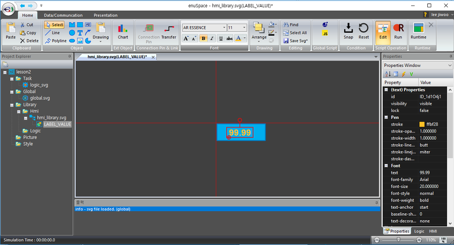

문자객체에 데이터를 디스플레이할 경우, 항상 사각형의 중앙정렬이 되도록 문자객체를 선택하고 Properties Window의 속성 text-anchor의 값을 middle로 설정합니다.

참고사이트 : [https://www.w3.org/TR/SVG/text.html\#TextAnchorProperty](https://www.w3.org/TR/SVG/text.html#TextAnchorProperty)


라이브러리를 OOP\(Object Oriented Programming\)기반으로 제작하기 위해서 멤버변수를 추가합니다. 디스플레이할 값과 연동하기 위한 변수를 추가합니다. Project Explorer-&gt;lesson2-&gt;Library-&gt;Hmi-&gt;hmi\_library.svg-&gt;LABEL\_VALUE를 선택하거나, 빈 공간을 선택합니다. 선택후 Properties 에서 변수를 추가합니다.


데이터 연동시 두가지 방법으로 추가가 가능합니다. 라이브러리의 멤버함수 ontaskview\(\)에 추가하는 방법과 TEXT 객체의 멤버함수 ontaskview\(\)함수에 추가하는 방법입니다.

라이브러리의 멤버함수에 ontaskview\(\)함수에 추가하는 스크립트 코드는 아래와 같습니다.

```lua
function _ontaskview()
{
    //TODO Add your javascript code here
    ID_LABEL.textContent = m_value.toString();
}
```

TEXT객체에 고유한 ID이름을 설정하고 고유한 ID값을 이용하여 텍스트의 값을 멤버변수 m\_value의 값을 문자열로 치환하는 방법입니다.

TEXT객체의 ontaskview\(\)함수에 추가하는 스크립트 코드는 아래와 같습니다.

```lua
function _ontaskview()
{
    //TODO Add your javascript code here
    textContent = m_value.toString();
}
```

TEXT객체 자체에 추가하는 스크립트 코드는 자신의 ID값을 적용할 필요없이 textContent 속성값을 호출하면 됩니다.

본 강좌에서는 라이브러리의 ontaskview\(\) 함수를 이용하여 구현합니다.

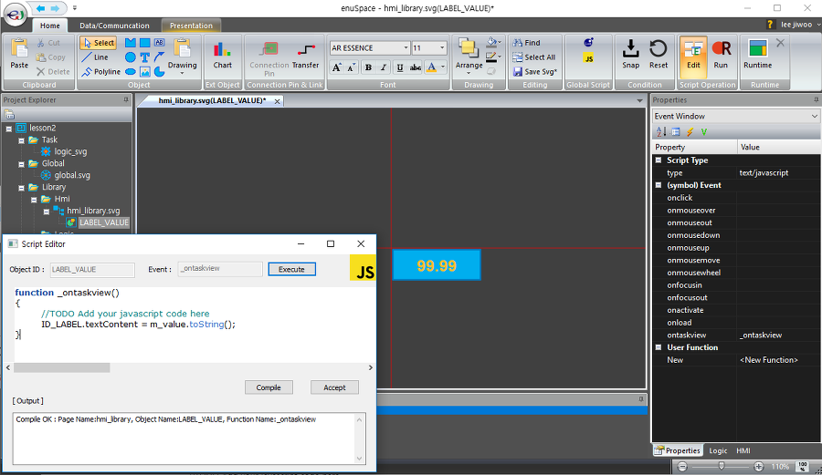

이로써 값을 디스플레이하는 다이나믹 패널이 제작 완료되었습니다.

## **Using HMI Library in picture**

---

앞에서 제작한 다이나믹 라이브러리를 이용하여 픽쳐를 구현해보도록 하겠습니다.

Project Explorer의 Picture를 선택후 오른쪽 버튼을 클릭하여 팝업메뉴를 호출합니다. sample로 입력후 Create 버튼을 클릭하여 새로운 픽쳐 페이지를 생성합니다.

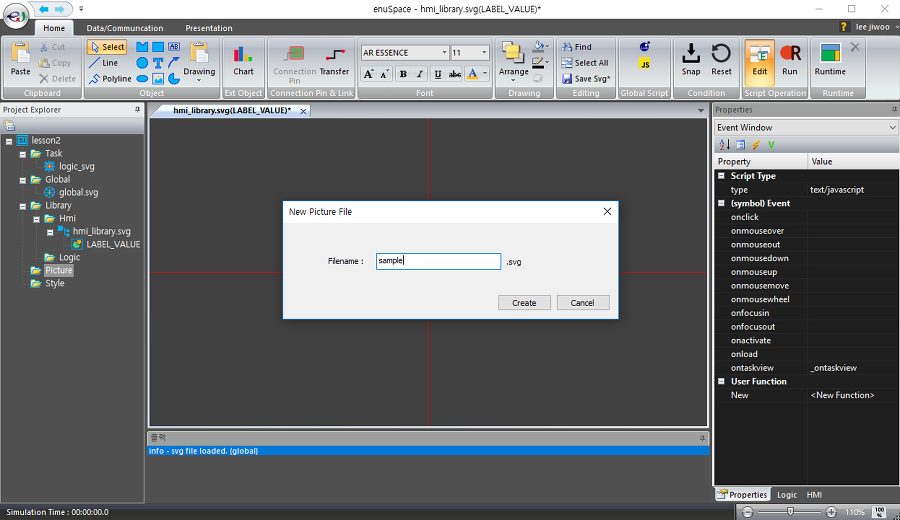

HMI 라이브러리 창을 클릭후 앞에서 생성한 라이브러리를 선택 후 Drag & Drop으로 객체를 생성합니다.

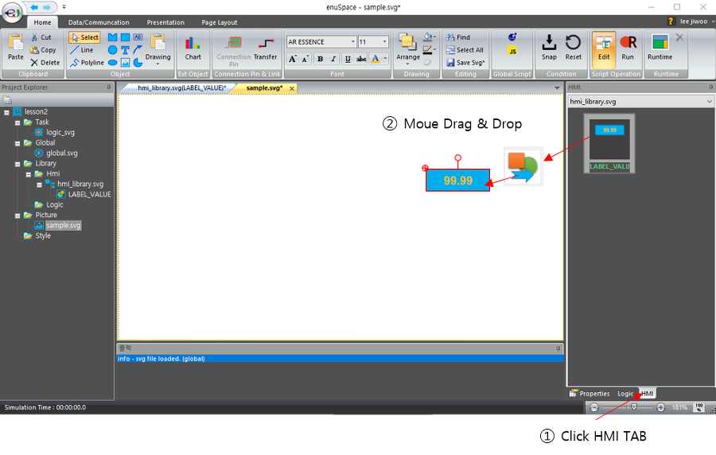

생성된 객체를 선택한후 속성창의 Variable Window에서 앞에서 추가한 멤버변수가 나타나고 값을 할당하기 위한 Set Attribute항목이 나타납니다. \#m\_value의 값으로 입력할 수 있는 타입은  2가지입니다.

1. 상수값을 입력합니다.

2. 인터페이스 되고자 하는 변수를 입력합니다.

어떠한값도 입력하지 않았을 경우에는 초기값을 유지합니다.


테스트를 위해서 Ribbon Menu-&gt;Script Operation의 Run 버튼을 클릭하여 스크립트를 기동합니다. 0으로 디스플레이 되는것을 확인할 수 있습니다. 50을 입력합니다. 아래 그림과 같이 50으로 변경되어 디스플레이 됨을 확인할 수 있습니다.


Set Attribute에 변수를 할당하기 위한 변수가 없기 때문에 sample.svg에 멤버변수를 추가하여 연동을 합니다. Project Explorer의 Picture하위 sample.svg를 선택하거나 Picture Window의 배경을 선택합니다. 속성창에서 Variable Window에서 픽쳐 변수를 생성합니다.


변수가 생성이 되었다면, 픽쳐의 멤버함수 ontask\(\)함수에 lua 스크립트를 이용하여 추가합니다. enuSpace의 lua 스크립트를 사용하는 경우는 특정 모델에 해당하는 연산을 수행하고자 할 경우에는 ontask\(\)함수를 사용합니다. ontask\(\)함수는 lua 스크립트에서만 추가가능합니다.

다음과 같이 루아 스크립트를 추가합니다.

```lua
function _ontask()
    --TODO Add your lua script code here
    m_double = m_double + 1
    if (m_double > 100) then
        m_double = 0
    end
end
```

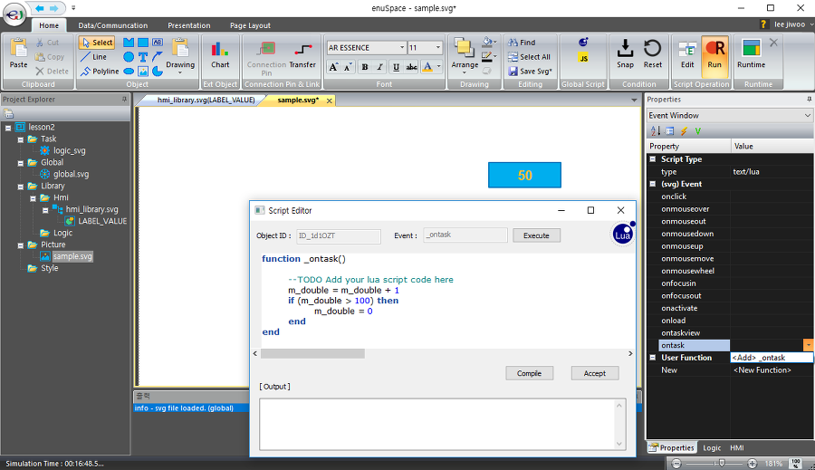

Ribbon Menu의 Home-&gt;Script Operation의 Run 버튼을 클릭하면, Task의 logic\_svg의 속성 Cycle\(Hz\)값에 따라 연산을 수행합니다. 간단하게 0에서 100까지 증가하는 연산을 구성하였다면, 앞에서 생성한 HMI 객체를 선택하고 Variable Window의 SetAttribute의 \#m\_value의 값에 \#m\_double을 입력합니다.

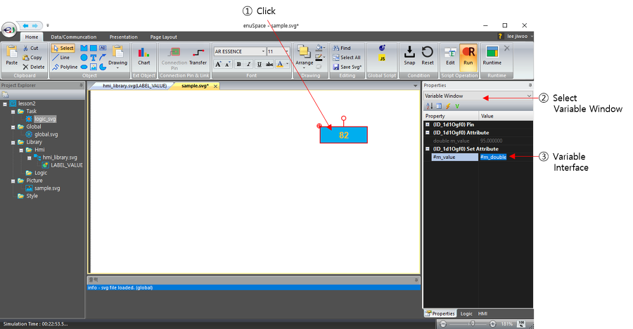

Picture에 추가한 멤버변수를 HMI 라이브러리의 변수를 연결을 수행하였습니다.**연결시 외부 데이터의 인터페이스를 수행하는 경우에는 변수명 앞에 \#을 입력**하여야 합니다.**\#의 의미는 데이터의 인터페이스를 의미**합니다.


Home-&gt;Runtime 버튼을 클릭하여, 실제 동작화면을 통하여 변수값 변경 및 색상값 변경에 대한 결과를 확인할 수 있습니다.

패널의 색상 및 사이즈를 조정하시고자 하는 경우가 발생할 경우에 별도의 라이브러리를 만들지 않고 라이브러리의 기능을 확장하여 사용할 수 있습니다.

다음 강좌에서는 HMI 라이브러리의 확장 사용방법에 대하여 알아보도록 하겠습니다.


# **enuSpace를 이용한 HMI 라이브러리 생성 및 적용 방법 \(2/2\)**

---

본 강좌에서는 다이나틱 데이터 디스플레이를 HMI Panel 라이브러리 제작하는 과정을 포함하고 있습니다.

[enuSpace를 이용한 HMI 라이브러리 생성 및 적용 방법\(1/2\)](./enustutorial_hmi-library.md)

강좌샘플 : [lesson2.zip](http://enuspace.tistory.com/attachment/cfile3.uf@220E2C4458F997E7232C7F.zip)

enuSpace를 이용한 HMI 라이브러리 생성 및 적용 방법\(1/2\)절에 이어서 심볼의 사이즈 조정인자와 심볼의 색상, 라벨의 색상값을 설정할 수 있는 인터페이스를 추가합니다.

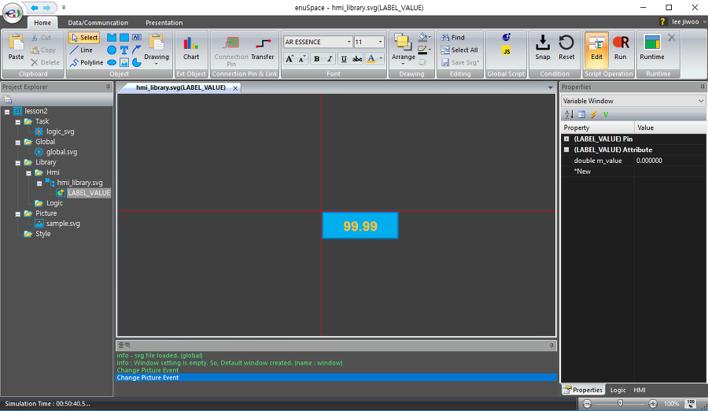

Project Explorer에서 LABEL\_VALUE를 선택후 Properties창에서 Variable Window를 선택합니다. 다음과 같이 4개의 변수를 추가합니다.


`double m_width;                // 라이브러리 폭 조정인자`

`double m_height;               // 라이브러리 높이 조정인자`

`wchar m_backcolor;             // 라이브러리 패널 색상 조정인자`

`wchar m_labelcolor;            // 라이브러리 라벨 색상 조정인자`

라이브러리에 추가된 멤버변수는 onload\(\) 함수를 통하여 연계를 수행합니다. onload\(\) 함수는 객체가 초기에 로드시 호출되며, 멤버변수의 속성을 변경 수행시 호출되는 함수입니다.

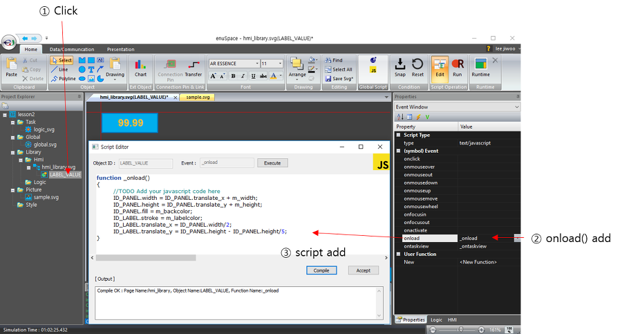

추가된  코드 내용을 보면 아래와 같습니다.

```lua
function _onload()
{
    //TODO Add your javascript code here
    ID_PANEL.width = ID_PANEL.translate_x + m_width;
    ID_PANEL.height = ID_PANEL.translate_y + m_height;
    ID_PANEL.fill = m_backcolor;
    ID_LABEL.stroke = m_labelcolor;
    ID_LABEL.translate_x = ID_PANEL.width/2;
    ID_LABEL.translate_y = ID_PANEL.height - ID_PANEL.height/5;
}
```

ID\_PANEL의 폭값은 ID\_PANEL의 위치 이동값과 사용자가 업데이트한 또는 초기화된 값의 합으로 설정되며, 높이 또한 동일한 연산을 통하여 ID\_PANEL의 사이즈롤 조정합니다.

또한, 패널의 내부 색상값은 멤버변수 m\_backcolor값과 라벨의 폰트 색상은 m\_labelcolor의 값을 이용하여 연계됩니다.

패널의 사이즈 조정시 라벨의 위치값도 조정을 해주어야 합니다. 라벨의 속성중 text\_anchor의 값은 middle로 설정되어 있기 때문에 폭의 중간값으로 설정하고 높이는 패널 높이의 4/5위치에 배치시켰다.

코드를 Compile 버튼을 클릭후 이전장에서 추가한 Project Explorer의 Picture의 sample.svg 파일을 오픈한다. 오픈을 수행하면 이전에 생성된 객체의 속성을 유지하고 있기 때문에 재로딩을 수행한다. 단축키 F5 버튼을 누르면 픽쳐페이지를 재로딩을 수행합니다. 수정한 라이브러리의 속성이 나타납니다.


sample.svg 픽쳐에 여러개의 LABEL\_VALUE객체를 추가하여 각 객체의 멤버변수의 값을 조정하여 테스트를 합니다. 색상값을 입력할 경우 rgb\(20,20,20\) 형태로 입력합니다.


라이브러리의 속성값 변경에 따른 디스플레이

LABEL\_VALUE 라이브러리에 패널의 외곽선 색상, 폰트의 사이즈에 대한 인터페이스도 추가하여 완성도 높은  라이브러리를 작성해 보세요.

