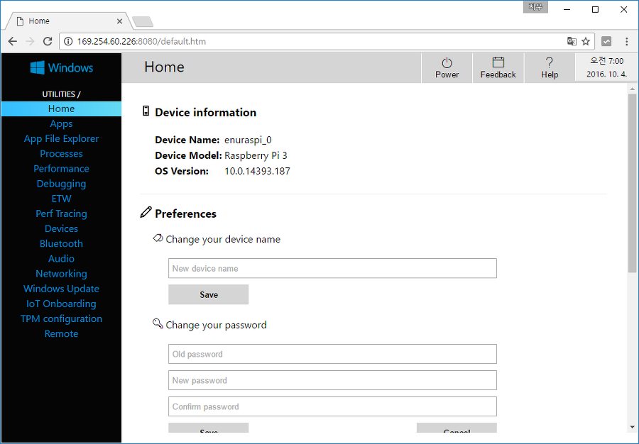
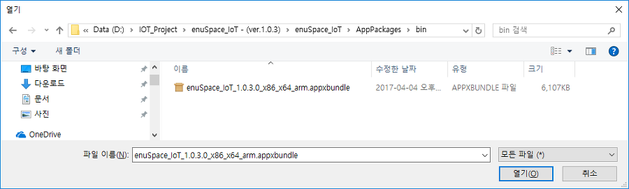
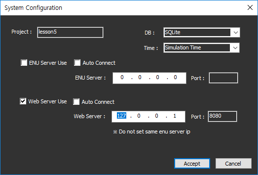
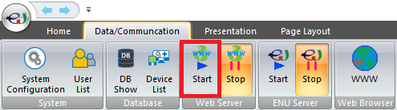
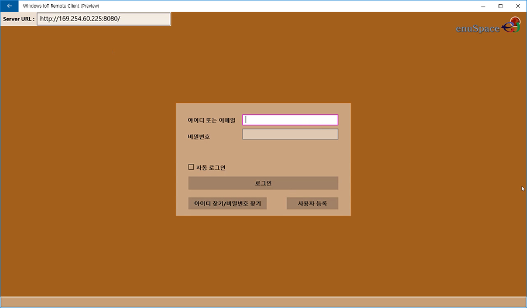
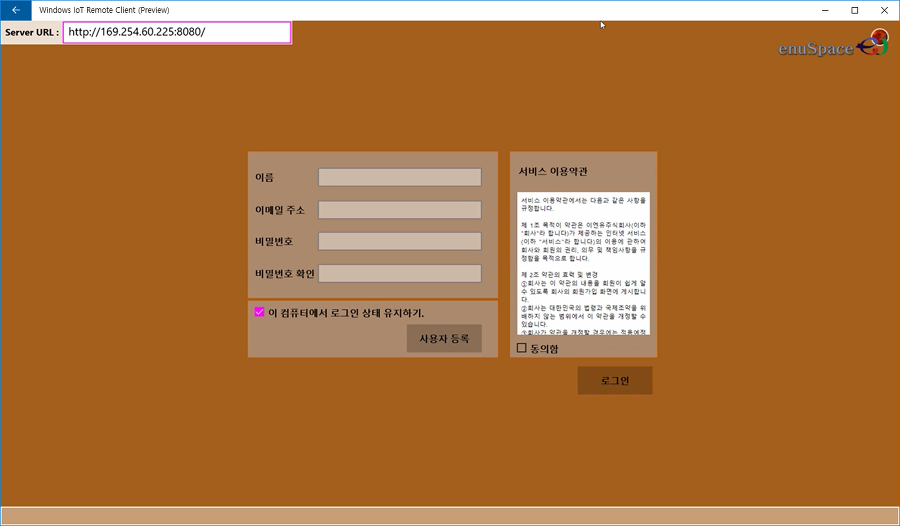

# **IoT Platform 사용방법**

---

본 강좌에서는 enuSpace for mars를 이용하여 IoT 디바이스의 센서값을 취득 및 데이터 로직을 구성하는 방법에 대하여 설명합니다.

enuSpace 학생용 버젼 다운로드 : [http://enuspace.tistory.com/entry/enuSpace-for-Mars-2017](http://enuspace.tistory.com/entry/enuSpace-for-Mars-2017)

**준비물**

Raspberry PI, Arduino, sensor

**프로그램 설치**

**    
**

## **1. Raspberry PI Installation \(software\)**

---

enuSpace for mars와 연동하기 위하여 Raspberry PI에 windows 10 iot core 운영체제를 설치후 다운로드 링크에서 응용 프로그램을 설치합니다.

windows 10 iot core 설치

설치 가이드 : [https://developer.microsoft.com/ko-kr/windows/iot/GetStarted](https://developer.microsoft.com/ko-kr/windows/iot/GetStarted)

마이크로소프트사에서 제공하는 설치 가이드를 기반으로 단계별로 설치 절차를 진행합니다.

윈도우 Edge 또는 웹브라우져를 이용하여 Window 10 iot core가 설치된 Raspberry PI에 접속을 수행합니다.

Windows 10 IoT Core의 기본 App의 IoTCoreDefaultApp 실행 화면입니다.

아래 그림과 같이 Raspberry PI와 Arduino 디바이스간에 USB Serial을 통하여 연결을 수행하고 아두이노에 센서 2종을 연결한 화면입니다.

Windows 10 IoT Core가 설치된 Raspberry PI에 아래 링크의 응용프로그램을 설치합니다.

download link :[http://enuspace.tistory.com/entry/enuSpace-for-Mars-2017](http://enuspace.tistory.com/entry/enuSpace-for-Mars-2017)

Windows 10 Core App : enuSpace\_IoT \(enuSpace\_IoT\_1.0.3.0\_x86\_x64\_arm.appxbundle\)

설정해상도는 1920 \*1080으로 설정하여야 정상적인 디스플레이가 가능합니다.

App package 에서 다운로드한 파일을 선택합니다.

Go 버튼을 클릭하여 설치를 수행합니다.

설치를 완료 합니다.

## **Arduino Installation \(software\) **

---

아두이노 디바이스에 아두이노 IDE에서 제공하는 StandardFirmata 프로그램을 설치합니다.

아두이노 IDE : [https://www.arduino.cc/en/Main/Software](https://www.arduino.cc/en/Main/Software)

라즈베리 파이\(Raspberry PI\)와 아두이노\(Arduino\)간에는 StandardFirmata를 이용하여 통신을 수행합니다.

### **프로그램 기동**

Raspberry PI와 Arduino에 프로그램을 설치 마무를 하였다면, 서버 프로그램을 기동합니다. enuSpace 프로그램을 기동하여 새로운 프로젝트를 생성합니다.

enuSpace의 웹서버를 기동합니다. 웹 서버를 기동하기 전에 리본메뉴 Data/Communication-&gt;System Configuration 버튼을 클릭하여 웹서버 사용 유무 및 ip와 포트를 설정합니다.

리본메뉴 Data/Communication-&gt;Web Server의 Start 버튼을 클릭하여 서버를 기동합니다.

서버 사이드 준비사항은 여기까지 입니다.

라즈베리 파이 응용프로그램을 기동하여 enuSpace 프로그램에 디바이스 등록과정을 통하여 센서의 데이터 및 입출력 핀 제어를 수행합니다.

**    
**

### **Raspberry PI -&gt; enuSpace iot 응용프로그램 기동**

라즈베리 파이에 설치한 enuSpace iot 응용프로그램을 실행합니다. 상단의 Server URL의 정보를 enuSpace서버의 ip주소와 포트 정보를 입력합니다.

enuSpace 서버사이드에 본 디바이스를 접속하고자 하는 경우 서버 사이드에 사용자 등록되어 로그인을 수행하여야 합니다. 신규 프로젝트를 생성시에는 사용자 등록 버튼을 클릭하여 사용자 등록을 수행합니다.

로그인 페이지는 자동 로그인 체크박스, 로그인 버튼, 아이디 찾기/비밀번호 찾기, 사용자 등록 버튼으로 구성, 자동 로그인 체크를 수행후 로그인을 실행하면, 다음 프로그램 재 기동시에는 자동 로그인이 수행됩니다.

로그인 페이지에서 사용자 등록버튼을 클릭하면, 아래 그림과 같이 사용자 등록을 수행하는 페이지로 전환되면, 사용자 등록 버튼을 클릭을 수행하면, 설정된 서버 주소\(enuSpace 서버 사이드\)에 사용자 등록 요청을 수행합니다.

정상적으로 사용자 등록과 로그인 페이지가 완료되면, 디바이스 등록 페이지가 나타납니다.

디바이스의 타입은 현재 연결된 아두이노의 타입을 설정합니다. 디바이스 키는 통합 저작 도구 IOT 서버에 등록될 디바이스 키 정보이며, 라즈베리 파이의 시스템 이름을 활용합니다.

신규 디바이스를 등록하는 경우에는 관련 디바이스의 정보와 변수 정보를 enuSpace에 등록하는 과정입니다. 디바이스 등록 버튼을 클릭합니다.

아두이노와 연결된 시리얼 포트 리스트에서 아두이노와 연계된 시리얼 포트를 선택후 연결 버튼을 클릭하여 연결 수행합니다. 연결이 정상적으로 수행이 되면, 아두이노의 센서 데이터값이 현시되며, enuSpace에 등록된 서버에 전송을 수행하여 서버 사이드에서 데이터베이스화 되어 저장됩니다. enuSpace 서버 응용 프로그램에서 리본메뉴 Device List와 DB Show 버튼을 클릭하여 등록된 내용을 확인할 수 있습니다.

enuSpace 서버 사이드에서 프로그램 설치시 사용된 라이브러리를 불러와 화면 작도를 수행합니다.아두이노 디바이스 심볼 객체의 속성 interface 설정값을 true로 설정하고, interface-id 항목에 \#+디바이스 이름을 입력합니다. 이 작업은 디바이스와 디바이스의 tag db의 값이 그래픽적인 라이브러리에 인터페이스 됨을 의미합니다.

사용자 정의 device 심볼을 구성하고자 하는 경우에는 아래와 같은 절차를 따라서 생성합니다.

Project Explorer 하위 Libarary의 Logic에 라이브러리 파일을 생성하고, 디바이스 라이브러리 노드 이름을 입력하고 노드를 생성합니다. 로직의 핀을 추가하고 추가된 핀의 name 속성값을 device의 variable이름으로 설정합니다.

다음 절에서는 클라이언트 웹 브라우져에서 랜더링을 위한 enuSpace 서버 사이드에서의 화면 구현 및 javascript 코드 구현 방법에 대하여 알아보겠습니다.

