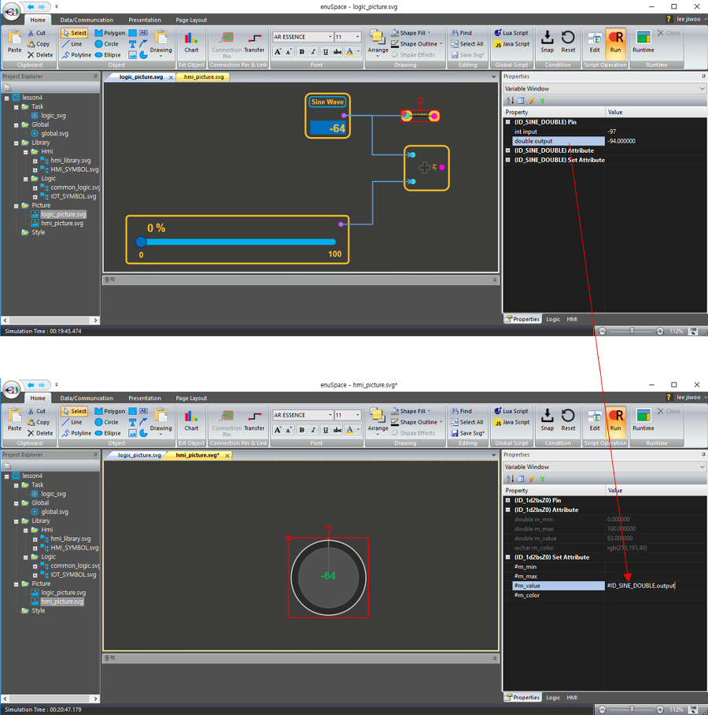

# **LOGIC 프로그램밍, HMI라이브러리 인터페이스 방법**

---

본 강좌에서는 로직 라이브러리를 이용하여 로직 프로그래밍을 수행하고, HMI 화면구성을 통하여 사용자 인터페이스 모니터링 및 제어화면을 구성하여 봅니다.

## **New Project**

---

새로운 프로젝트를 생성하기 위해서 Home-&gt;New-&gt;New Project 메뉴를 선택합니다.


New Project \(popup window\)윈도우가 나타나면, 솔루션 이름과 솔루션을 저장할 디렉토리를 설정후 OK버튼을 클릭합니다.


## **Import Library**

---

기존 제작한 Logic 및 hmi 라이브러리르 가져오기 위해서, Project Explorer의 Library의 팝업메뉴 Add Existing Hmi Library 메뉴를 이용합니다.

예시로 enuSpace for mars 설치시 포함된 presentation 디렉토리의 logic 라이브러리 파일을 선택하여 가져오기를 수행합니다. 기존 라이브러리는 유지하고, 본 프로젝트의 Library 디렉토리에 파일을 복사수행 후 로드를 수행합니다.


Properties 윈도우에서 상단의 콤보박스를 이용하여 해당사하는 라이브러리의 썸네일 이미지를 확인할 수 있습니다.

불러온 라이브러리를 편집하고자 하는 경우에는, Project Explorer의 Library에서 HMI 또는 Logic의 파일의 하위의 심볼 아이템을 선택하여 Graphic 편집알 통하여 심볼을 편집합니다.

## **New Picture**

---

Create New Picture file

2개의 픽쳐화면을 생성합니다. 하나의 화면에는 로직 프로그래밍을 위한 픽쳐 페이지이고, 로직 프로그래밍에서의 입출력 변수 변수값을 사용자에게 제공할  HMI 화면작도를 위한 픽쳐입니다.

* 각종 연산 및 제어를 위한 로직을 구성하기 위해서 logic\_picture.svg 파일을 추가합니다.

* logic\_picture.svg 파일에서 구성한 로직을 제어하기 위한 hmi\_picture.svg 파일을 추가합니다.


본 강좌에서는 로직변수를 HMI변수에 적용하는 방법에 대하여 설명합니다.

우선 간단하게 로직 페이지에 임의의 로직 객체를 추가합니다. 아래그림과 같이 로직을 추가하고 각각의 로직 객체의 id값을 고융한 id로 설정합니다.


로직 페이지 구성을 완료하였다면, hmi\_picture.svg 파일에 로직의 값을 표현할 HMI 객체를 추가합니다.


## **Set Attribute**

---

HMI 객체의 Properties 윈도우의 Variable Window를 확인하여 보면, 내부 멤버변수\(Attribute\)와 할당될 Assing 변수\(Set Attribute\)할당 부분이 있습니다. HMI 객체 제작시 제작자가 제공하는 인터페이스입니다. 자세한 구현 부분을 보고자 하는 경우에는 라이브러리 편집 모드에서 자세한 코드 구현 부분을 확인하시면 됩니다.

본 예에서서는 추가된 HMI 객체에 logic\_picture.svg파일에서 추가한 객체의 입력값을 인터페이스 합니다. 로직객체 ID\_SINE\_DOUBLE객체의 output값을 HMI객체에 연결하기 위해서 Set Attribute의 속성에**\#+로직변수명**을 입력합니다.



추가한 HMI 라이브러리 gauge\_pie의 라이브러리 제작은 아래와 같이 구성되어 있습니다. 인터페이스를 위한 멤버변수 m\_value값에 따라서 게이지값을 표현되도록 구현된 라이브러리 입니다. gauge\_pie의 라이브러리는 내부 구성을 보면 svg의 path객체가 포함되어 있습니다. path객체의 속성 d값을 변경하여 값에 따라 회전위치 정보를 계산하는 로직입니다. svg의 path정보는 사이트에서 좀더 자세히 확인해 보실수 있습니다.

참고 : [https://www.w3schools.com/graphics/svg\_path.asp](https://www.w3schools.com/graphics/svg_path.asp)

```js
function _ontaskview()
{
    //TODO Add your javascript code here
    var datagap = m_max-m_min;
    var data = m_value;
    if (data < m_min)
        data = m_min;
    else if (data >m_max)
        data = m_max;
    var angle = ((360 * (data-m_min)) / (m_max - m_min) - 90);
    // M40,40 L35.42,79.76 A40.00,40.00 0 1,0 40.00,0.00 Z
    var x1 = 80+Math.cos(angle * 3.141592 / 180)*80;
    var y1 = 80+Math.sin(angle * 3.141592 / 180)*80;
    var dir = 0;
    if (angle+90>180)
        dir = 1;
    ID_GAUGE.d = "M80,80 L"+x1.toString()+ ","+y1.toString()+" A80.00,80.00 0 "+ dir.toString()+",0 80.00,0.00 Z";
    ID_LABEL.textContent = m_value.toString();
    ID_GAUGE.fill = m_color;
}
```


내부 페이지 또는 별도의 페이지에 존재하는 로직 객체의 변수를 HMI 객체에 연동하는 방법에 대하여 알아보았습니다.


