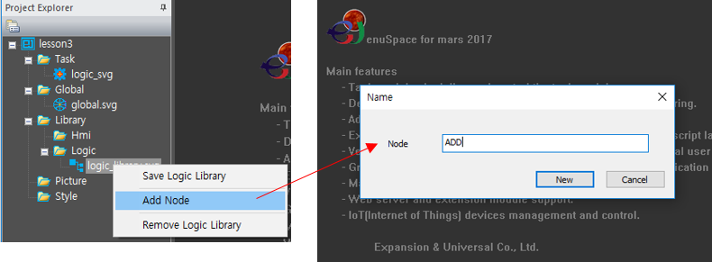
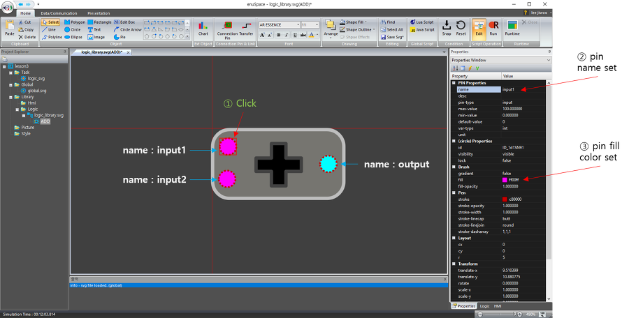
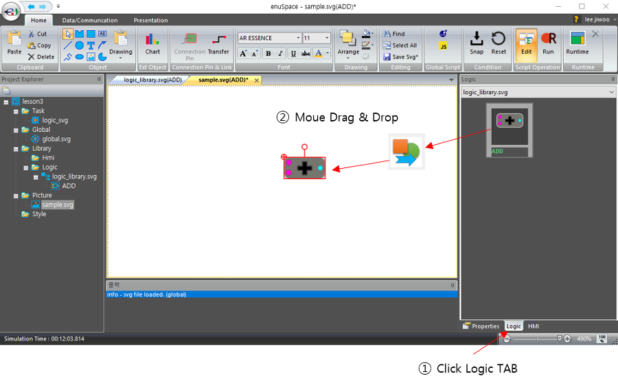
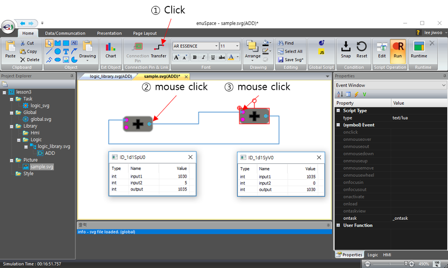
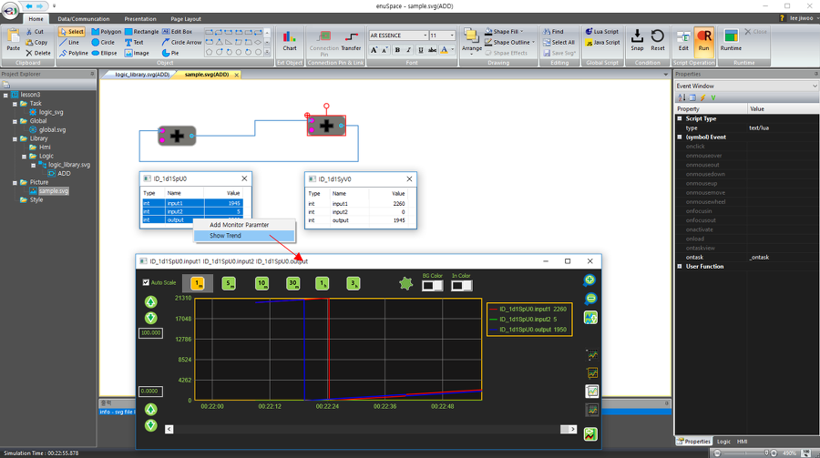

# **enuSpace를 이용한 LOGIC 라이브러리 생성 및 적용 방법**

---

본 강좌에서는 로직 라이브러리 생성 방법과 생성된 로직을 이용하여 프로그래밍 방법에 대하여 설명합니다.

강좌샘플 : [lesson3.zip](http://enuspace.tistory.com/attachment/cfile4.uf@244CD14C58F9B847130DC8.zip)

동영상 미리보기 [https://youtu.be/UhjH0\_FrBuc](https://youtu.be/UhjH0_FrBuc)

# **New Project**

---

새로운 프로젝트를 생성하기 위해서 Home-&gt;New-&gt;New Project메뉴를 선택합니다.


New Project \(popup window\)윈도우가 나타나면, 솔루션 이름과 솔루션을 저장할 디렉토리를 설정후 OK 버튼을 클릭합니다.


## **New Logic library**

---

Project Explorer-&gt;Library-&gt;Logic 아이템을 선택후 마우스 오른쪽 버튼을 클릭하여 팝업메뉴를 호출합니다. 팝업메뉴 Add New Hmi Library를 선택하여 라이브러리 이름을 입력합니다.


두개의 입력을 받아서 더하기 연산을 수행하는 ADD 로직 라이브러를 생성하기 위해서, Project Explorer에 추가된 logic\_library.svg 파일을 선택, 팝업메뉴 Add Symbol을 선택하여 심볼의 이름을 ADD로 입력하고 New 버튼을 클릭합니다.



추가된 ADD 라이브러리를 선택하고 디자인을 수행합니다. 간단하게 사각형 객체와 Path 객체를 추가후

Ribbon Menu-&gt;Home-&gt;Connection Pin을 선택후 Graphic 윈도우에 마우스를 클릭하여 Connection Pin 객체를 생성합니다. 두개의 입력과 하나의 출력 핀을 생성하여 배치를 수행합니다.

배치를 모두 마치고나면, 각 핀의 이름을 설정합니다. 설정된 입력핀은 스크립트에서 사용되는 변수명으로 사용됩니다.

입력 핀과 출력 핀의 색상을 바꾸어 직관적 이해가 가능하도록 구성합니다.



위와 같이 입출력핀 구성을 마무리 하였다면, 라이브러리에 로직용 스크립트를 추가합니다. 라이브러리의 멤버함수 ontask\(\) 함수를 추가합니다.

```lua
function _ontask()
    --TODO Add your lua script code here
    output = input1 + input2
end
```


이로써 더하기 연산을 수행하는 ADD 로직 라이브러리가 완성되었습니다. 추가적인 디자인과 현재값을 현시하는 라벨을 추가하거나 다양한 표현을 추가적으로 구성할 수 있습니다.

## **Using Logic Library in picture**

---

앞에서 제작한 로직 라이브러리를 이용하여 로직화면을 구성하도록 하겠습니다.

Project Explorer의 Picture를 선택후 오른쪽 버튼을 클릭하여 New Picture file 다이얼로그를 호출합니다. filename을 sample을 일력하여 새로운 픽쳐파일을 생성합니다.


Logic 라이브러리 창을 클릭후 앞에서 생성한 라이브러리를 선택후 Drag & Drop으로 객체를 생성합니다.



로직을 연산을 수행하기 위해서 Ribbon Menu-&gt;Home-&gt;Script operation의 Run 버튼을 클릭하여 기동을 수행합니다.

추가된 객체를 마우스를 이용하여 더블 클릭하면, 로직의 입출력 테이블이 나타납니다. 테이블의 값 부분을 더블 클릭하여 입력값을 수정합니다.


입력값에 따라서 변경되는 것을 확인할 수 있습니다.

아래 그림과 같이 로직 객체를 추가하여 Ribbon menu의 Home-&gt;Transfer 메뉴를 이용하여 객체간에 연결을 수행합니다.



테이블의 입력값을 조정하여 로직을 연산결과를 확인할 수 있습니다.

팝업 테이블의 변수리스트를 다중 선택하여 팝업 TREND로 데이터를 확인할 수 있습니다.



Trend의 활용 방법은 Trend 사용하기 튜터리얼을 참고하시기 바랍니다.

