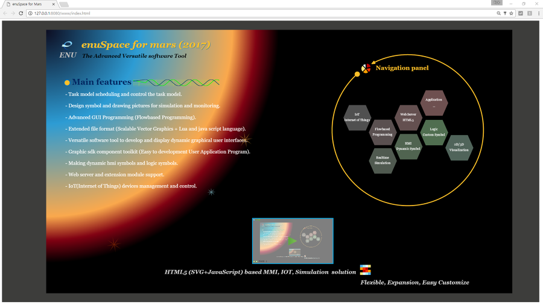
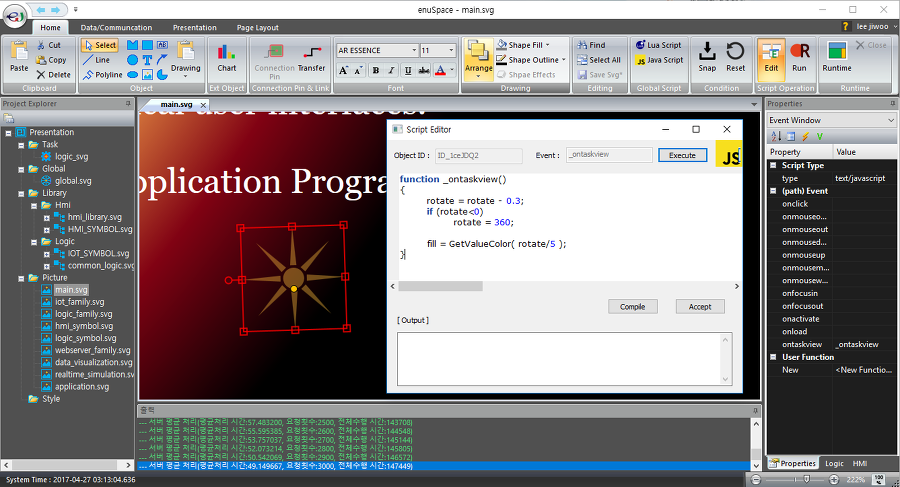
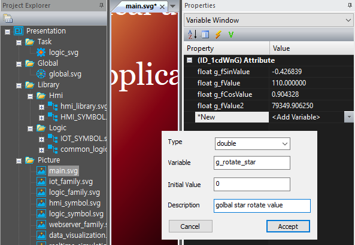
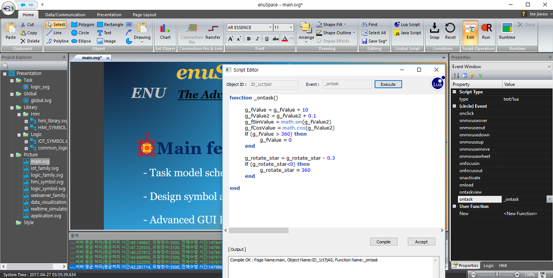

# **Web 연동 및 사용방법**

---

본 강좌에서는 enuSpace를 이용하여 웹 브라우져에 화면 디스플레이 및 데이터 인터페이스를 구성하는 방법에 대하여 설명합니다.

enuSpace for mars 다운로드 : [http://enuspace.tistory.com/entry/enuSpace-for-Mars-2017](http://enuspace.tistory.com/entry/enuSpace-for-Mars-2017)

enuSpace는 javascript와 lua script를 제공합니다. 웹 브라우져에서 동적인 현시를 위해서 javascript로 제작합니다.

enuSpace의 내부 구조와 웹 브라우져 랜더러간의 인터페이스 구조는 아래그림과 같습니다.


enuSpace에서 task scheduler는 lua 스크립트로 구현된 ontask\(\)함수를 설정된 주기에 맞추어 호출되어 연산을 수행합니다. 또한, 뷰어가 드로잉시에 호출되는 ontaskview\(\)함수는 루아스크립트와 자바스크립트 모두 이용할 수 있습니다. 웹 브라우져에서 랜더러의 함수 호출시에는 자바스크립트로 적용된 ontaskview\(\)함수만 적용됩니다.

웹 브라우져는 첫 기동시 서버측에 그래픽 리소스 svg 파일을 요청하며 관련 데이터를 연동합니다. 웹 브라우져는 내부 랜더러에서 서버 사이드에서 가져온 데이터와 ontaskview\(\)함수를 호출하여 자신의 화면을 갱신합니다. 특정값을 제어하기 위해서 SetTagValue\(\) 함수를 호출하여 서버사이드의 값을 제어합니다.

## enuSpace introduce의 설명

---

enuSpace for mars의 최신 버젼을 다운로드 하시면, 샘플 프로젝트 introduce를 오픈합니다.


리본메뉴 Data/Communication-&gt;Web Browser 버튼을 클릭하여 브라우져를 실행합니다.

웹 브라우져 창에 사용자 로그인창이 나타나고, 사용자 리스트에 추가된 로그인 정보를 이용하여 로그인을 수행합니다.



여기에서 살펴볼 내용은 서버 사이드의 로직 변수, 전역변수 그리고 데이터베이스 tag 변수들에 대한 내용과 연동되는 부분과 enuSpace와 웹 랜더러간의 독립된 표현에 대한 부분이다.

enuSpace 편집기에서 태양주의를 돌고 있는 별을 하나 선택하여 ontaskview\(\) 함수를 확인하여 보면 다음과 같이 구현되어 있다.



```js
function _ontaskview()
{
    rotate = rotate - 0.3;
    if (rotate<0)
        rotate = 360;
    fill = GetValueColor( rotate/5 );
}
```

선택한 path객체\(star\)는 자신의 회전값을 0.3씩 줄이는 코드이며 0이하로 떨어진경우에는 초기값 360도로 설정하는 코드이다. 본 코드의 내용으로는 enuSpace의 서버와 웹 브라우져간의 동일한 현시를 수행하는 코드의 처리방식이 아니다.

만약 객체의 서버사이드의 회전값과 동일한 디스플레이를 수행하고자 하는 경우에는 다음과 같이 코드를 수정하여 보자.

main.svg를 선택하고 최상단에 전역변수를 하나 설정한다. 변수명은 g\_rotate\_star으로 하고 double 형으로 생성한다.



생성된 g\_rotate\_star변수의 값을 갱신하는 코드를 추가하여야 한다. 이미 Main features 글자 객체 왼쪽에 원객체가 추가 되어 있다. 원 객체를 선택하고 Properties 윈도우의 Event 속성을 보면 Script Type에 text/lua 설정되어 있으며, ontask\(\)함수를 수정한다.



다음과 같이 추가 코드를 작성한다.

```lua
g_rotate_star = g_rotate_star - 0.3 
if (g_rotate_star<0) then
   g_rotate_star = 360
end
```

다음으로 그래픽 path 객체\(star\)의 ontaskview\(\)함수를 다음과 같이 수정하자.

수정 전\)

```js
function _ontaskview()
{
    rotate = rotate - 0.3;
    if (rotate<0)
        rotate = 360;
    fill = GetValueColor( rotate/5 );
}
```

수정 후\)

```js
function _ontaskview()
{
    rotate = g_rotate_star;
    fill = GetValueColor( rotate/5 );
}
```

수정후 전역변수의 값을 이용하여 회전값을 적용하도록 구성하였다.


enuSpace의 기동화면 모습과 웹 브라우져에서의 랜더링 출력 위치가 동일한 위치에서 출력되고 있음을 확인할 수 있다. 위 예제는 전역변수를 이용한 인터페이스 방법에 대하여 설명한 내용이다. 전역변수, 로직객체의 pin 변수, 데이터베이스의 tag변수는 동일한 형태로 연계하여 웹 브라우져에 동일한 디스플레이가 가능합니다.

## **데이터베이스 TAG 인터페이스**

---

데이터베이스 TAG를 이용하여 인터페이스를 위하여 데이터베이스 TAG 변수 하나를 추가합니다.

`TYPE : double`

`TAGID : @Presentation.rotate`

`VARIABLE : rotate`

전역변수값을 디스플레이 위한 Text 객체를 추가하고 ontaskview\(\)함수에 디스플레이 코드를 추가합니다.

```js
function _ontaskview()
{
    //TODO Add your javascript code here
    textContent = GetTagValue("@Presentation.rotate").toString();
}
```

사각형 객체 2개를 추가하고, 각각 데이터베이스 TAG의 값을 변경하는 코드를 추가합니다.

```js
function _onmousedown()
{
    //TODO Add your javascript code here
    SetTagValue("@Presentation.rotate", 90);
}
function _onmousedown()
{
    //TODO Add your javascript code here
    SetTagValue("@Presentation.rotate", 45);
}
```


enuSpace의 RunTime에서 사각형 객체를 클릭하여 Tag값이 변경됨을 확인할 수 있으며, 클라이언트 웹 브라우져에서 사각형 객체를 클릭하여 tag값이 변경되어 디스플레이 됨을 확인할 수 있습니다.


## **전역변수 및 로직객체 PIN 변수의 인터페이스**

---

enuSpace에서는 전역변수와 로직객체의 PIN 변수의 인터페이스를 위하여 SetValue\(\), GetValue\(\) 함수를 제공합니다.

SetValue 함수의 사용 예\)

```js
function _onmousedown()
{
    //TODO Add your javascript code here
    SetValue(ID_ARD.A0, 99);
}
```

GetValue 함수의 사용 예\)

```js
function _ontaskview()
{
    //TODO Add your javascript code here
    textContent = GetValue(ID_ARD.A0).toString();
}
```

\* GetValue의 함수는 클라이언트 웹에서 특정 이벤트에 의해서 서버의 값을 가져와 처리하는 경우에 사용하며, 일반적으로 다음과 같이 코드를 사용하기를 권고합니다. \(빠른 응답 속도\)

`textContent = GetValue(ID_ARD.A0).toString();  => textContent = ID_ARD.A0.toString();`

\* SetValue의 함수 또한 클라이언트 웹에서 특정 이벤트에 의하여 서버의 값을 설정하는 경우에 사용하며, 일반적으로 다음과 같이 코드를 사용하기를 권고합니다. \(빠른 응답 속도\)

`SetValue(ID_ARD.A0, 99); => ID_ARD.A0 = 99;`

본 절에서는 웹 브라우져와 연동시에 사용하는 함수에 대하여 알아보았습니다.

