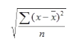
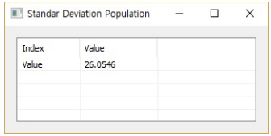

# StdevP

Ensor.StdevP\(Ensor\* pEnsor\)

#### Parameters

* Ensor\* pEnsor

Ensor.new() 함수등에 의해 만들어진 포인터를 입력합니다(data).

#### Return Value

Ensor\* pRetEnsor : The population standard deviation 가진 Ensor\*를 반환합니다.

#### Remarks

Returns the population standard deviation.
The equation for the population standard deviation is:




#### Examples1

```lua
function MathEquation()
	local ensor_x = ensor.new("{1345,1301,1368,1322,1310,1370,1318,1350,1303,1299}")
	local ensor_y = ensor.StdevP(ensor_x)
	ensor.Table(ensor_y)

end
```

#### Result




