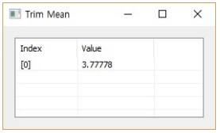

# TrimMean

Ensor.TrimMean\(Ensor\* pEnsor, double k\)

#### Parameters

 * Ensor\* pEnsor
	Ensor.new() 함수등에 의해 만들어진 포인터를 입력합니다(data set).
 * double k
	k 값을 입력합니다(0 < percent value < 1).


#### Return Value

Ensor\* pRetEnsor : TrimMean을 가진 Ensor\*를 반환합니다

#### Remarks

Returns the mean of the interior of a data set.

TrimMean calculates the mean taken by excluding a percentage of data points from the top and bottom
tails of a data set.

TrimMean rounds the number of excluded data points down to the nearest multiple of 2. If percent = 0.1,
10 percent of 30 data points equals 3 points. For symmetry, TrimMean excludes a single value from the
top and bottom of the data set.

#### Examples1

```lua
function MathEquation()
	local ensor_x = ensor.new("{4,5,6,7,2,3,4,5,1,2,3}")
	local ensor_y = ensor.TrimMean(ensor_x,0.2)
	ensor.Table(ensor_y)
end
```

#### Result1


