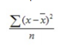
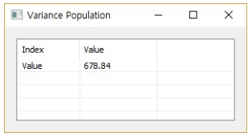

# VarP

Ensor.VarP\(Ensor\* pEnsor\)

#### Parameters

* Ensor\* pEnsor

Ensor.new() 함수등에 의해 만들어진 포인터를 입력합니다(data).


#### Return Value

Ensor\* pRetEnsor : The population variance가진 Ensor\*를 반환합니다.

#### Remarks

Returns the population variance.
The equation for the population variance is:



where x is the sample mean Average(data) and n is the sample size.

#### Examples1

```lua
function MathEquation()
	local ensor_x = ensor.new("{1345,1301,1368,1322,1310,1370,1318,1350,1303,1299}")
	local ensor_y = ensor.VarP(ensor_x)
	local ensor_y2 = ensor.VarS(ensor_x)
	ensor.Table(ensor_y)
	ensor.Table(ensor_y2)


end
```

#### Result1



