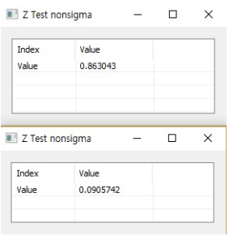

# ZTest

Ensor.ZDist\(Ensor\* pEnsor, double x \)
Ensor.ZDist\(Ensor\* pEnsor, double x,double sigma\)

#### Parameters

 * Ensor\* pEnsor
	Ensor.new() 함수등에 의해 만들어진 포인터를 입력합니다.
 * double x
	테스트할 값을 입력합니다.(The value to test).
 * double sigma
	알려진 표준편차를 입력합니다.(The population standard deviation)


#### Return Value

Ensor\* pRetEnsor : 계산된 Ensor\*를 반환합니다.


#### Remarks

Returns the one-tailed P-value of a z-test.
sigma가 없으면 입력된 데이터의 표준편자를 대신 이용합니다.

#### Examples1

```lua
function MathEquation()
	local ensor_x = ensor.new("{3,6,7,8,6,5,4,2,1,9}")
	local ensor_y = ensor.ZTest(ensor_x,4)
	local ensor_y2 = ensor.ZTest(ensor_x,6)
	ensor.Table(ensor_y)
	ensor.Table(ensor_y2)
end
```

#### Result1



